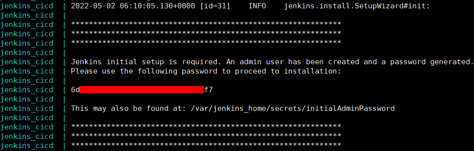
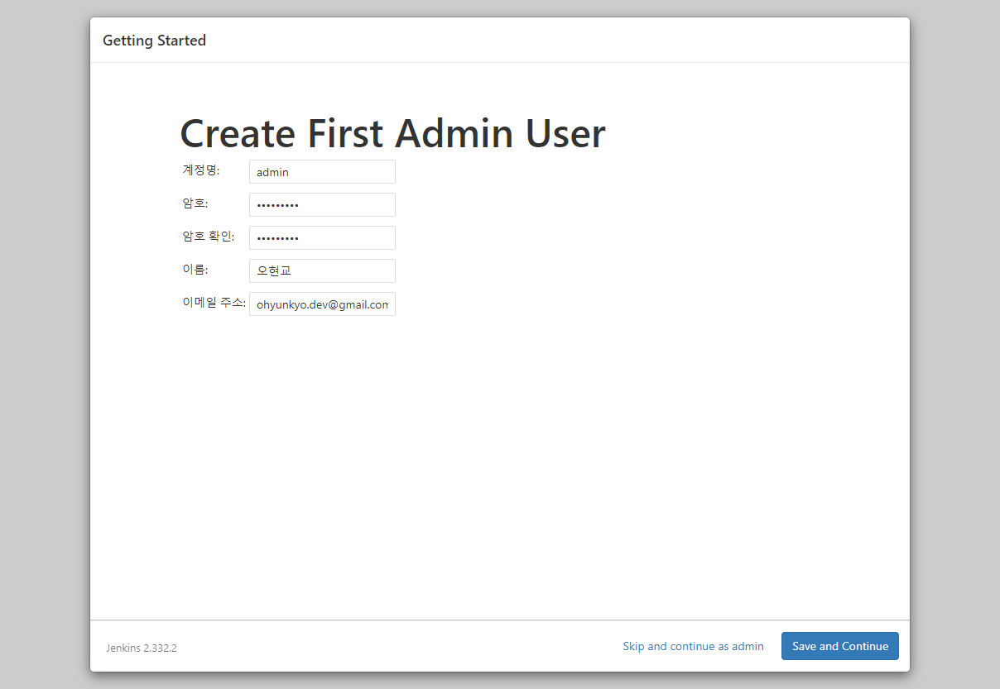
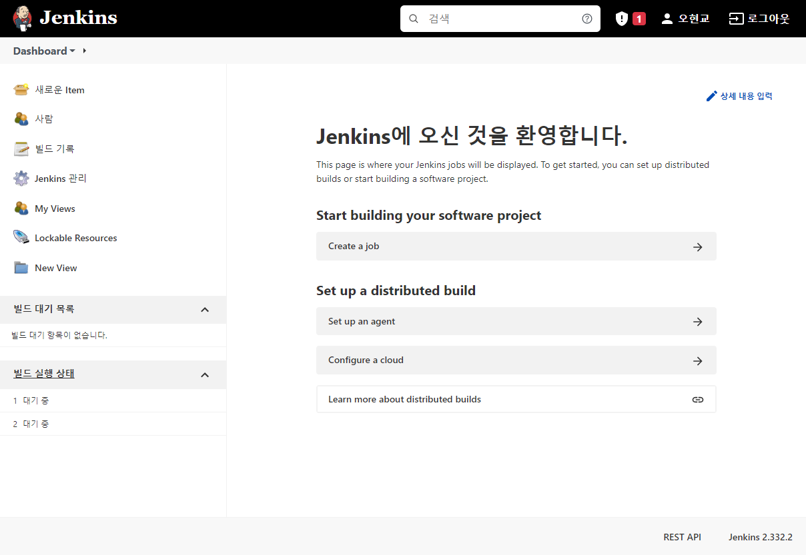
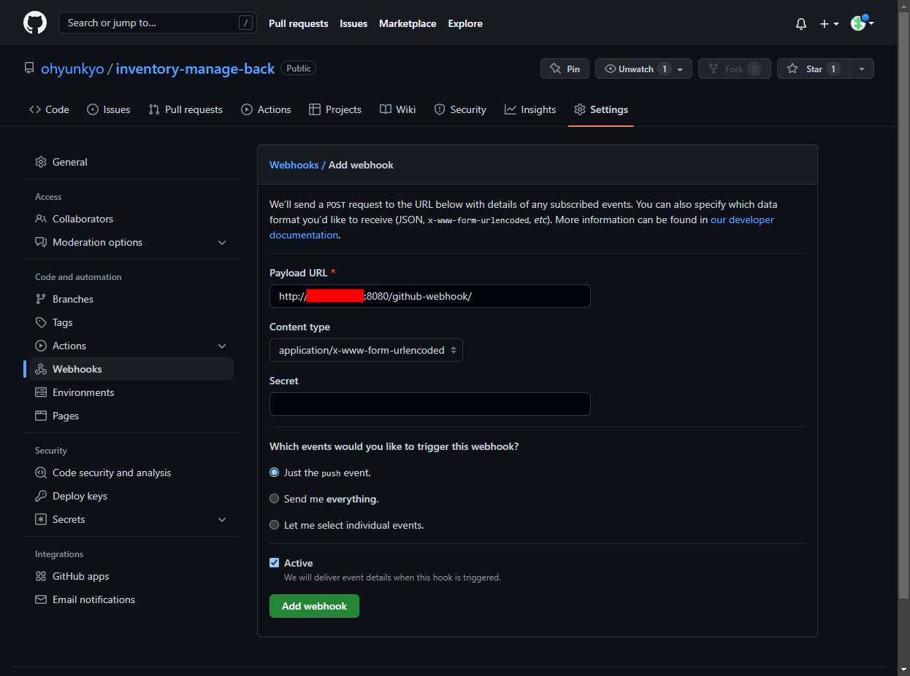
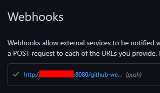
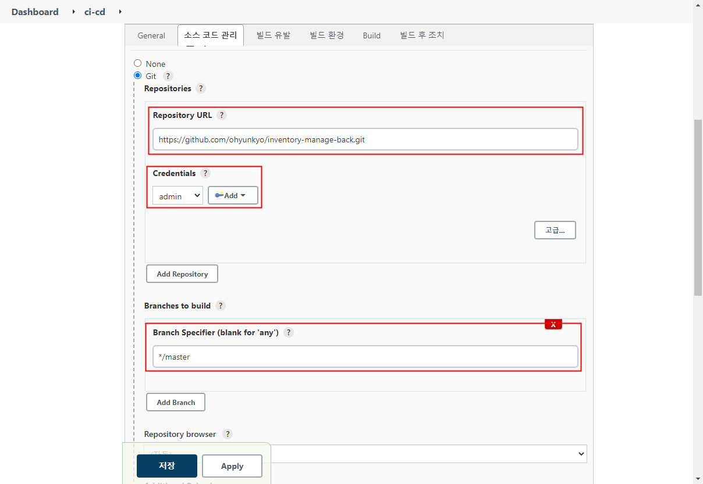
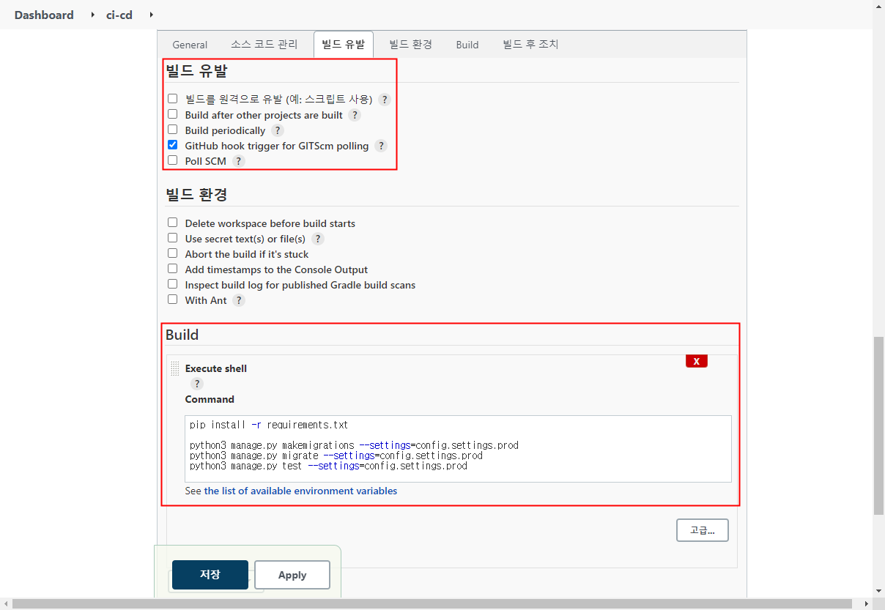
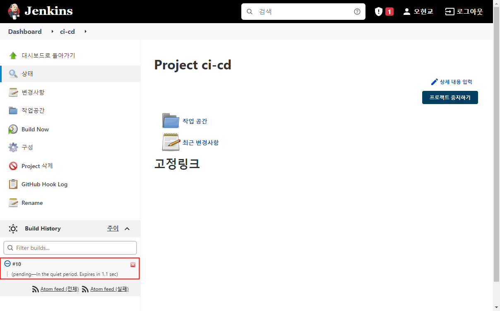

## 0. 서론
지금 온라인중인 서비스는 `django` 로만 만들어져 있다.  
그리고 서버에서 환경설정 후 깃허브 저장소에서 소스코드를 수동으로 가져와 제공하고 있다.

이것을 프론트와 백엔드 구분을 위해 vue.js - drf 구조로 변경했고, CI/CD 를 위해 젠킨스를 사용하기로 결정했다.  
그리고 back-end 는 도커 컨테이너를 통해 제공하고, front-end 는 S3 를 통해 배포하기로 결정했다.
```
# 최종 목표 기술 스택 
 
front-end : vue.js / S3
back-end : django / docker on EC2
db : rds(mysql)
CI/CD : jenkins
```

가장먼저 back-end 배포를 하고 있는데, 그 작업을 정리한다.

[전체 출처](https://www.dongyeon1201.kr/9026133b-31be-4b58-bcc7-49abbe893044)

## 1. CI/CD 서버 구성
EC2 인스턴스를 하나 생성했다. t3.small 타입이였고, 나머지 구성 요소들은 현재 온라인중인 서버에서 사용중이던것을 그대로 사용했다.  
하나 주의해야 할 점은 젠킨스에서 사용할 포트를 허용하도록 설정해야 한다는것이다. 

인스턴스 생성 방법에 대해선 생략한다.

## 2. CI/CD 서버에 jenkins 설치
방금전 생성한 서버에 jenkins 서비스를 올릴것이다. 이것 또한 도커의 컨테이너를 사용한다면 설치나 관리하기 편할것이다.

일단 EC2 인스턴스에 docker 와 docker-compose 를 설치한다.
```shell
# docker 설치

$ sudo yum update
$ sudo amazon-linux-extras install -y docker
$ sudo systemctl start docker
$ sudo systemctl enable docker
```
인스턴스 재시작시 도커가 실행되도록 했다.

```shell
# docker-compose 설치

$ sudo curl -SL https://github.com/docker/compose/releases/download/v2.4.1/docker-compose-linux-x86_64 -o /usr/local/bin/docker-compose
$ sudo chmod +x /usr/local/bin/docker-compose
$ sudo ln -s /usr/local/bin/docker-compose /usr/bin/docker-compose
```

[docker-compose 설치](https://docs.docker.com/compose/install/)

그 다음에 젠킨스 컨테이너 생성을 위한 yml 파일을 생성한다. 
```shell
$ mkdir jenkins
$ vi jenkins/docker-compose.yml
```

docker-compose 에 대해 잘 모르기 때문에 일단 전체를 그대로 사용하고 넘어갔다.
```yml
# jenkins/docker-compose.yml

version: '3'

services:
    jenkins:
        image: jenkins/jenkins:lts
        container_name: jenkins_cicd
        volumes:
            - /var/run/docker.sock:/var/run/docker.sock
            - /jenkins:/var/jenkins_home
        ports:
            - "8080:8080"
        privileged: true
        user: root
```

이제 `docker-compose up -d` 명령어로 컨테이너를 생성하고 실행한다. 이렇게 하면 젠킨스 서비스가 실행된다.

> docker-compose.yml 파일이 있는곳에서 명령어를 실행해야 한다. 해당 파일의 볼륨에 있는 로그를 가져오는듯

다음과 같이 브라우저에 URL 을 입력하여 젠킨스 서비스 화면을 확인해 볼 수 있다.

> \[EIP]:8080 (ex: 10.0.0.0:8080)

## 3. jenkins 설정하기 
처음 보는 화면에서 젠킨스는 비밀번호부터 물어본다. 비밀번호는 이미 생성된 상태인데, 다음 명령어에서 확인 가능하다
```shell
$ docker-compose logs
```



이 비밀번호를 입력하고 들어가면 기본적인 설정을 해야한다. 실제로 할것은 크게 없고 다음으로 넘어가기만 하면 된다.

### 3.1 플러그인 설치
Install suggested plugins 을 눌러 필요한 플러그인이 자동으로 설치되도록 한다.  

  


### 3.2 계정 생성
설치가 완료되면 계정을 생성해야 한다.  

  

### 3.3 URL 설정
젠킨스 url 설정하는 부분. 잘 모르는 부분이라 default 대로 설정하고 넘겼다.  


### 3.4 완료
완료되었다!!  


### 3.5 메인화면 확인
내가 확인한 젠킨스 메인화면



## 4. github 와 jenkins 연동하기
github 저장소가 업데이트 되면 jenkins 로 알리고 빌드하도록 연동한다.

### 4.1 jenkins ssh key 설정
젠킨스와 깃허브는 ssh key 를 통해 연결된다.
#### 4.1.1 키 조합 생성
아래의 명령어로 젠킨스 컨테이너의 쉘에 접속한다. 컨테이너 이름인 `jenkins_cicd` 가 아니라 컨테이너 id 로도 접속 가능하다. 
```shell
$ sudo docker exec -it jenkins_cicd /bin/bash
```

이제 깃허브와 연결할 ssh 키를 생성한다
```
# mkdir /var/jenkins_home/.ssh

# ssh-keygen -t rsa -f /var/jenkins_home/.ssh/jenkins_ci
```
#### 4.1.2 jenkins 에 개인 키 등록
`/var/jenkins_home/.ssh/jenkins_ci` 파일(개인 키)의 내용을 젠킨스에 등록해야 한다.

> \[EIP]:8080/credentials/store/system/domain/_/newCredentials  

위의 경로로 들어가서 다음 사진과 같이 선택하고 개인 키를 붙여넣는다

 

#### 4.1.3 github 에 공개 키 등록
이번엔 `/var/jenkins_home/.ssh/jenkins_ci.pub` 파일(공개 키)의 내용을 깃허브에 등록해야 한다.

> https://github.com/[username]/[reponame]/settings/keys/new

위의 경로로 들어가서 다음 사진과 같이 공개 키를 붙여넣는다


### 4.2 github webhook 설정<a id='4.2-github-webhook-설정'></a>
이제 깃허브에서 이벤트 발생 시 젠킨스에게 알리도록 할것이다.  
젠킨스에는 깃허브 플러그인이 설치되어 있어서 깃허브에서만 설정해주면 바로 사용 가능하고 한다.

> https://github.com/[username]/[reponame]/settings/hooks/new

위의 경로로 들어가서 다음 사진과 같이 Payload URL 에 `[EIP]:8080/github-webhook/` 을 입력후 추가한다.  
기본 옵션이 push 이벤트만 알리도록 하는것인데 지금 당장은 다른 이벤트 알림은 필요 없기 때문에 따로 설정할건 없다.


그 다음엔 정상적으로 연결되었는지 확인한다. 만약 초록섹 체크 표시가 아니라면 젠킨스 서버 EC2 인스턴스의 SG를 확인해봐야 한다.  
만약 SG 인바운드 규칙을 수정했는데도 커넥션이 정상적이지 않다면 새로고침만 계속 누르지 말고 삭제 후 다시 등록하자.  


> `Let me select individual events.` 를 선택하면 거의 모든 이벤트(포크, Key 추가 등)에서 웹훅 트리거를 작동 시킬 수 있는것같다.

## 5. jenkins job 설정
job 이란 젠킨스에서 실행되는 작업의 단위라고 한다. 이 job 을 생성하고 어떤 작업이 수행될지 정의한다.

### 5.1 job 생성하기
> \[EIP]:8080/view/all/newJob

위의 경로에서 이름을 정하고 Freestyle project 를 선택한 뒤 다음으로 넘어간다.


### 5.2 소스코드 관리 탭 설정하기<a id='5.2-소스코드-관리-탭-설정하기'></a>

깃허브를 통해 소스코드를 관리할것이기 때문에 당연히 Git 을 선택한다.  
Repository URL 에는 본인의 깃허브 저장소 주소를 적어주고, Credentials 에는 아까 추가한 키를 선택한다.  

그리고 빌드할 브랜치를 설정하는데, ? 를 눌러 설명을 보면 알겠지만 하나의 job 에서는 하나의 브랜치만 빌드 할 때 효과적이라고 한다.  
게다가 나는 기능 개발시 새로운 브랜치를 생성하고 완료되면 master 브랜치에 반영하고 있기 때문에 master 브랜치만 빌드하도록 설정하는것이 개발 완료된 기능만을 빌드하는것이라고 볼 수 있다.

### 5.3 빌드 설정


#### 5.3.1 빌드 유발
빌드 유발 옵션에서 `GitHub hook trigger for GITScm polling` 를 선택했다.  
이 옵션이 선택되어 있다면 깃허브에서 훅을 수신 했을 때, 이 훅의 저장소가 [4.3.2](#5.2-소스코드-관리-탭-설정하기) 에서 설정한 저장소와 일치하는지 확인한다.

> [4.2](#4.2-github-webhook-설정) 에서 push 이벤트만이 웹훅 트리거를 작동시키도록 설정했기 때문에 해당 저장소에 push 할 경우에만 훅을 수신한다.

일치한다면 저장소에 대해서 폴링(소스코드를 가져오는것)한다. 폴링할 때 변경사항이 있다면 빌드를 시작한다. 

> [5.2](#5.2-소스코드-관리-탭-설정하기) 에서 master 브랜치만 빌드하도록 설정했기 때문에 해당 브랜치만 폴링하고 빌드한다.(라고 이해했음)

#### 5.3.2 build
마지막으로 빌드할때 실행될 코드를 작성한다.    
나는 django 를 사용하기 때문에 django 를 테스트 하기 위한 코드를 추가했다.
```shell
# 의존성 패키지를 설치하고 마이그레이션 후 테스트하는 코드

pip install -r requirements.txt

python3 manage.py makemigrations --settings=config.settings.prod
python3 manage.py migrate --settings=config.settings.prod
python3 manage.py test --settings=config.settings.prod
```

#### 5.4 테스트를 위한 도구 설치
실제로 job 이 실행되는지 보기 전에, 빌드할때 테스트가 잘 실행되도록 테스트에 사용할 도구를 먼저 설치해야 한다.    

> 물론 깃허브에 push 할 때 테스트 완료된 코드를 올리겠지만 실제 운영환경에서 테스트 해보는것이다.(라고 이해했음)

테스트코드 실행을 위한 도구를 설치하기 위해 컨테이너의 쉘에 다시 한번 접속한다.
```shell
$ sudo docker exec -it jenkins_cicd /bin/bash
```

django 를 테스트 하기 위한 도구를 설치했다.
```shell
apt-get update -y
apt-get install -y
apt-get install docker.io -y
apt-get install python3 pip -y
pip install django==3.2.6
```

그리고 mysqlclient 의 원활한 설치를 위해 관련된 패키지도 설치했다. [출처](https://pypi.org/project/mysqlclient/)  
```shell
apt-get install python3-dev default-libmysqlclient-dev build-essential -y
```

### 6. 연결 테스트 하기
젠킨스와 깃허브 연동도 했고 깃허브 저장소에 push 했을 때 실행 될 job 도 만들어줬다.  
이제 master 브랜치에 push 했을 때 젠킨스로 전달되어 빌드되는지 확인해볼 시간이다.  

우선 개발 PC 에서 master 브랜치로 push 한다.  
그러면 다음 사진과 같이 해당 젠킨스 프로젝트의 build history 에 빌드가 하나 추가 된 것을 볼 수 있다.  
지금까지 한 작업이 모두 정상적이였다는것이다.  



시간이 지나면 이렇게 빌드가 완료된다.  


만약 빌드가 실패했다면 Console Output 탭에서 로그를 확인할 수 있다.