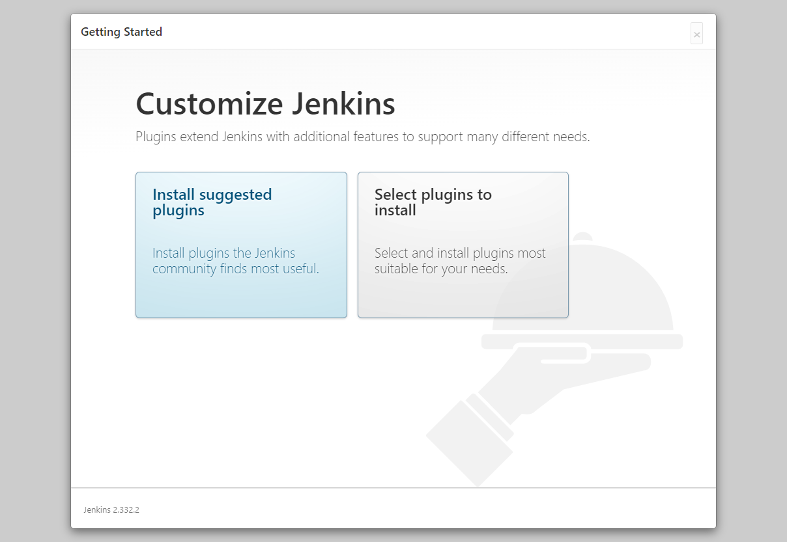
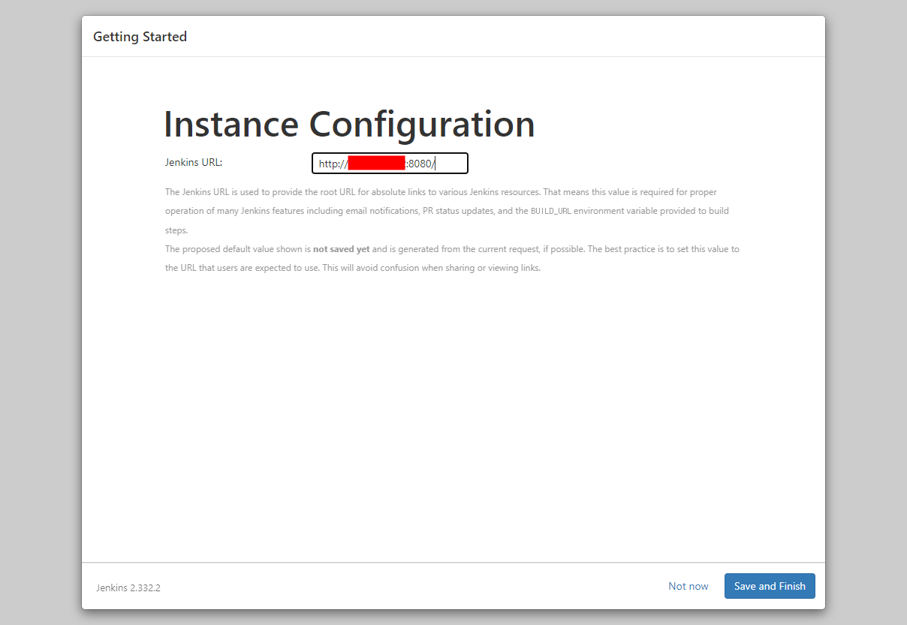
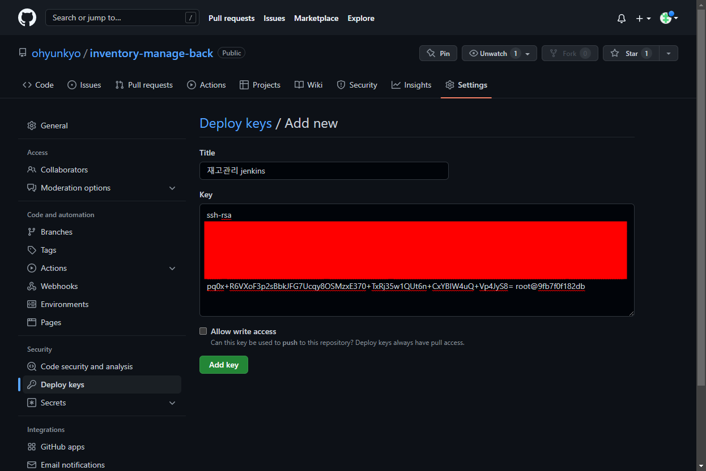
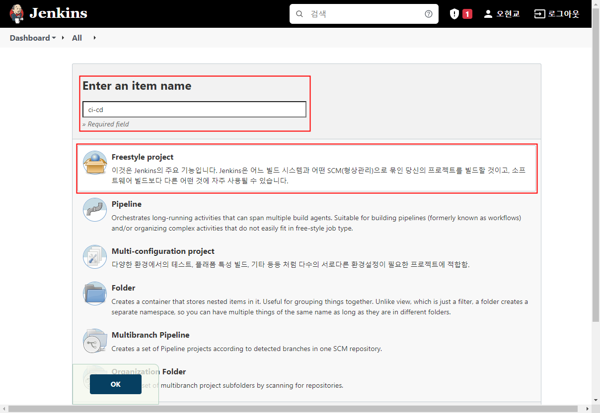
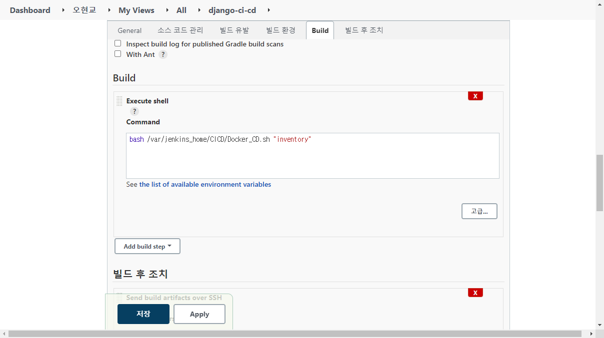
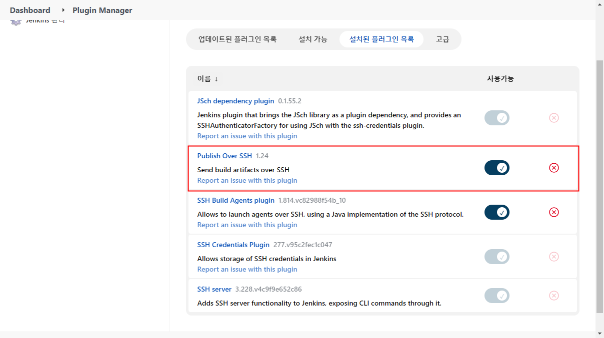
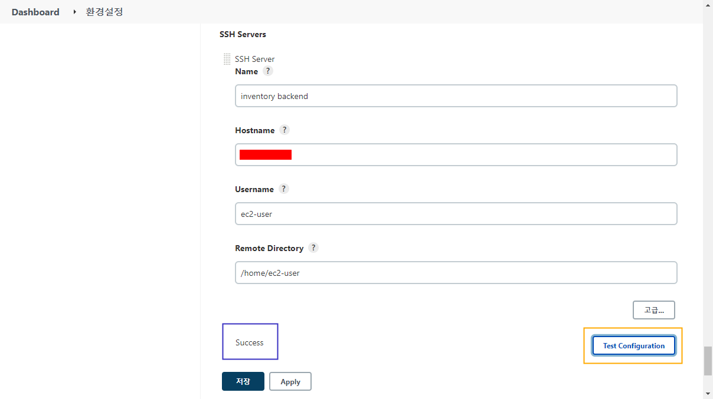

> 다음 링크의 내용을 참고하여 작성한 글입니다.  
> https://www.dongyeon1201.kr/9026133b-31be-4b58-bcc7-49abbe893044

## 0. 서론
지금 온라인중인 서비스는 `django` 로만 만들어져 있다.
개발 수정사항을 깃허브에 푸쉬 하면 EC2에서 저장소의 소스코드를 수동으로 가져와야 한다.

소스코드를 리팩토링 하는 과정에서 프론트와 백엔드 구분을 위해 vue.js - drf 구조로 변경했고, 수동으로 소스코드를 가져오는 불편함을 해소하기 위해 젠킨스를 사용한 CI/CD 를 도입하기로 결정했다. 또한 백엔드는 도커 컨테이너를 통해 제공하고, 프론트는 S3 를 통해 배포하기로 결정했다.
```
# 최종 목표 기술 스택 
 
front-end : vue.js / S3
back-end : django / docker on EC2
db : rds(mysql)
CI/CD : jenkins
```

프론트와 백엔드 구분은 이미 완료했고 이후 젠킨스를 통해 백엔드를 배포 하는 과정을 정리했다.  
AWS 나 도커에 대한 기본 지식은 보유했다고 가정하고 최대한 생략할 예정이다.

목표하는 전체적인 배포 프로세스는 다음과 같다.
1. 개발 수정사항 github master branch 에 push
2. 젠킨스를 사용하여 해당 수정사항 테스트 
3. 결과를 텔레그램으로 전달
4. 테스트 성공시 docker image build
5. build 된 이미지를 docker hub 에 업로드
6. docker hub 의 이미지를 사용하여 컨테이너 실행

## 1. 젠킨스 서버 구성
```
# EC2 스펙

AMI : amzn2-ami-kernel-5.10-hvm-2.0.20220426.0-x86_64-gp2
인스턴스 유형 : t3.small
```
EC2 인스턴스를 하나 생성했다. 젠킨스에서 사용할 포트(여기에선 80 을 사용)를 열어주기만 하면 크게 신경 쓸 것은 없다.

방금 만든 것을 젠킨스 서버라고 부르기로 하자.

## 2. 젠킨스 서버에서 jenkins 서비스 실행<a id='2.-젠킨스-서버에서-jenkins-서비스-실행'></a>
젠킨스 서버에 jenkins 서비스를 올릴것이다. 편의를 위해 도커를 사용해 컨테이너 형태로 제공한다. 

도커 사용을 위해 개별적으로 설치 하던것들을 간단한 쉘 스크립트를 작성하여 간편하게 만들어봤다.  
일단 `/home/ec2-user/jenkins_server_settings.sh` 파일에 아래의 내용을 붙여넣는다.
```shell
# jenkins_server_settings.sh

# docker install
sudo yum update -y
sudo amazon-linux-extras install -y docker -y
sudo systemctl start docker
sudo systemctl enable docker

# docker compose install
sudo curl -SL https://github.com/docker/compose/releases/download/v2.4.1/docker-compose-linux-x86_64 -o /usr/local/bin/docker-compose
sudo chmod +x /usr/local/bin/docker-compose
sudo ln -s /usr/local/bin/docker-compose /usr/bin/docker-compose

# directory for jenkins service
mkdir -p jenkins_config

# creating django test module
echo "apt-get update -y
apt-get install -y
apt-get install docker.io -y
apt-get install python3 pip -y
pip install django==3.2.6

apt-get install python3-dev default-libmysqlclient-dev build-essential -y" > /home/ec2-user/jenkins_config/django_module_installer.sh

sudo chmod +x ./jenkins_config/django_module_installer.sh

# creating docker-compose.yml file
echo "version: '3'

services:
    jenkins:
        image: jenkins/jenkins:lts
        container_name: jenkins_cicd
        volumes:
            - /var/run/docker.sock:/var/run/docker.sock
            - /home/ec2-user/jenkins_home:/var/jenkins_home
            - /home/ec2-user/jenkins_config/django_module_installer.sh:/var/jenkins_home/scripts/django_module_installer.sh
        ports:
            - \"80:8080\"
        privileged: true
        user: root
        secrets:
            - django_secret
        command: sh -c \"/var/jenkins_home/scripts/django_module_installer.sh && /sbin/tini -- /usr/local/bin/jenkins.sh\"
	
secrets:
    django_secret:
        file: /home/ec2-user/secrets/django_secret.json" > /home/ec2-user/jenkins_config/docker-compose.yml

# container up
sudo docker-compose -f /home/ec2-user/jenkins_config/docker-compose.yml up -d
```

먼저 각각의 주석을 상세히 설명하자면 다음과 같다
1. `docker install` : 도커 패키지를 설치하고 인스턴스 재시작시 도커가 실행되도록 했다.
2. `docker compose install` : `docker-compose` 명령어 사용을 위해 패키지를 설치하고 심볼릭 링크를 걸어줬다.
3. `directory for jenkins service` : 젠킨스 서비스를 위한 설정파일이 위치할 디렉토리를 생성했다.
4. `creating django test module` : 이후 파이프라인 빌드시 프로젝트 테스트를 위한 패키지를 설치하는 쉘을 작성했다.
5. `creating docker-compose.yml file` : 실제로 컨테이너가 생성될 때 사용될 설정파일을 생성한다.
6. `container up` : `docker-compose.yml` 파일을 사용하여 컨테이너를 생성한다.

이제 이 `jenkins_server_settings.sh` 파일을 실행한다.

```shell
$ sh jenkins_server_settings.sh
```

이제 브라우저에 젠킨스 서버 IP 를 입력하면 젠킨스 서비스 화면을 확인해 볼 수 있다.

## 3. jenkins 설정하기 


젠킨스를 시작하기 위해서는 암호가 필요하다. 이 암호는 이미 생성된 상태인데, 아래의 명령어를 사용하여 확인 가능하다
```shell
$ sudo docker-compose -f /home/ec2-user/jenkins_container_config/docker-compose.yml logs
```


이 비밀번호를 입력하고 들어가면 기본적인 설정을 해야한다. 실제로 할것은 크게 없고 다음으로 넘어가기만 하면 된다.

### 3.1 플러그인 설치
`Install suggested plugins` 은 가장 유용한 플러그인을 알아서 설치해준다. 젠킨스가 익숙하지 않다면 이 옵션을 사용하자.

  


### 3.2 계정 생성
설치가 완료되면 계정을 생성해야 한다. 이후 젠킨스에 로그인 할 때에는 이 계정을 사용한다. 

  

### 3.3 URL 설정
젠킨스 url 설정하는 부분. 잘 모르는 부분이라 건들지 않고 넘겼다.  



### 3.4 완료
완료되었다!!  


### 3.5 메인화면 확인
내가 확인한 젠킨스 메인화면


## 4. github 와 jenkins 연동하기
github 저장소가 업데이트 되면 jenkins 로 알리고 빌드하도록 연동한다.

### 4.1 jenkins ssh key 설정
젠킨스와 깃허브는 ssh key 를 통해 연결된다.
#### 4.1.1 키 조합 생성
아래의 명령어로 젠킨스 컨테이너의 쉘에 접속한다. 컨테이너 이름인 `jenkins_cicd` 가 아니라 컨테이너 id 로도 접속 가능하다. 
```shell
$ sudo docker exec -it jenkins_cicd /bin/bash
```

이제 깃허브와 연결할 ssh 키를 생성한다
```
# mkdir /var/jenkins_home/.ssh

# ssh-keygen -t rsa -f /var/jenkins_home/.ssh/jenkins_ci
```
#### 4.1.2 jenkins 에 개인 키 등록
`/var/jenkins_home/.ssh/jenkins_ci` 파일(개인 키)의 내용을 젠킨스에 등록해야 한다.

> \[젠킨스 서버 IP]:8080/credentials/store/system/domain/_/newCredentials  

위의 경로로 들어가서 다음 사진과 같이 선택하고 개인 키를 붙여넣는다

 

#### 4.1.3 github 에 공개 키 등록
이번엔 `/var/jenkins_home/.ssh/jenkins_ci.pub` 파일(공개 키)의 내용을 깃허브에 등록해야 한다.

> https://github.com/[username]/[reponame]/settings/keys/new

위의 경로로 들어가서 다음 사진과 같이 공개 키를 붙여넣는다



### 4.2 github webhook 설정<a id='4.2-github-webhook-설정'></a>
이제 깃허브에서 이벤트 발생 시 젠킨스에게 알리도록 할것이다.  
젠킨스에는 깃허브 플러그인이 설치되어 있어서 깃허브에서만 설정해주면 바로 사용 가능하고 한다.

> https://github.com/[username]/[reponame]/settings/hooks/new

위의 경로로 들어가서 다음 사진과 같이 Payload URL 에 `[젠킨스 서버 IP]:8080/github-webhook/` 을 입력후 추가한다.  
기본 옵션이 push 이벤트만 알리도록 하는것인데 지금 당장은 다른 이벤트 알림은 필요 없기 때문에 따로 설정할건 없다.


그 다음엔 정상적으로 연결되었는지 확인한다. 만약 초록섹 체크 표시가 아니라면 젠킨스 서버 EC2 인스턴스의 SG를 확인해봐야 한다.  
만약 SG 인바운드 규칙을 수정했는데도 커넥션이 정상적이지 않다면 새로고침만 계속 누르지 말고 삭제 후 다시 등록하자.  


> `Let me select individual events.` 를 선택하면 거의 모든 이벤트(포크, Key 추가 등)에서 웹훅 트리거를 작동 시킬 수 있는것같다.

## 5. jenkins job 설정
job 이란 젠킨스에서 실행되는 작업의 단위라고 한다. 이 job 을 생성하고 어떤 작업이 수행될지 정의한다.

### 5.1 job 생성하기
> \[젠킨스 서버 IP]:8080/view/all/newJob

위의 경로에서 이름을 정하고 Freestyle project 를 선택한 뒤 다음으로 넘어간다.


### 5.2 소스코드 관리 탭 설정하기<a id='5.2-소스코드-관리-탭-설정하기'></a>

깃허브를 통해 소스코드를 관리할것이기 때문에 당연히 Git 을 선택한다.  
Repository URL 에는 본인의 깃허브 저장소 주소를 적어주고, Credentials 에는 아까 추가한 키를 선택한다.  

그리고 빌드할 브랜치를 설정하는데, ? 를 눌러 설명을 보면 알겠지만 하나의 job 에서는 하나의 브랜치만 빌드 할 때 효과적이라고 한다.  
게다가 나는 기능 개발시 새로운 브랜치를 생성하고 완료되면 master 브랜치에 반영하고 있기 때문에 master 브랜치만 빌드하도록 설정하는것이 개발 완료된 기능만을 빌드하는것이라고 볼 수 있다.

### 5.3 빌드 설정


#### 5.3.1 빌드 유발
빌드 유발 옵션에서 `GitHub hook trigger for GITScm polling` 를 선택했다.  
이 옵션이 선택되어 있다면 깃허브에서 훅을 수신 했을 때, 이 훅의 저장소가 [4.3.2](#5.2-소스코드-관리-탭-설정하기) 에서 설정한 저장소와 일치하는지 확인한다.

> [4.2](#4.2-github-webhook-설정) 에서 push 이벤트만이 웹훅 트리거를 작동시키도록 설정했기 때문에 해당 저장소에 push 할 경우에만 훅을 수신한다.

일치한다면 저장소에 대해서 폴링(소스코드를 가져오는것)한다. 폴링할 때 변경사항이 있다면 빌드를 시작한다. 

> [5.2](#5.2-소스코드-관리-탭-설정하기) 에서 master 브랜치만 빌드하도록 설정했기 때문에 해당 브랜치만 폴링하고 빌드한다.(라고 이해했음)

#### 5.3.2 build
마지막으로 빌드할때 실행될 코드를 작성한다.    
나는 django 를 사용하기 때문에 django 를 테스트 하기 위한 코드를 추가했다.
```shell
# 의존성 패키지를 설치하고 마이그레이션 후 테스트하는 코드

pip install -r requirements.txt

python3 manage.py makemigrations --settings=config.settings.prod
python3 manage.py migrate --settings=config.settings.prod
python3 manage.py test --settings=config.settings.prod
```

### 5.4 테스트를 위한 도구 설치
실제로 job 이 실행되는지 보기 전에, 빌드할때 테스트가 잘 실행되도록 테스트에 사용할 도구를 먼저 설치해야 한다.    

> 물론 깃허브에 push 할 때 테스트 완료된 코드를 올리겠지만 실제 운영환경에서 테스트 해보는것이다.(라고 이해했음)

테스트코드 실행을 위한 도구를 설치하기 위해 컨테이너의 쉘에 다시 한번 접속한다.
```shell
$ sudo docker exec -it jenkins_cicd /bin/bash
```

django 를 테스트 하기 위한 도구를 설치했다.
```shell
apt-get update -y
apt-get install -y
apt-get install docker.io -y
apt-get install python3 pip -y
pip install django==3.2.6
```

그리고 mysqlclient 의 원활한 설치를 위해 관련된 패키지도 설치했다. [출처](https://pypi.org/project/mysqlclient/)  
```shell
apt-get install python3-dev default-libmysqlclient-dev build-essential -y
```

## 6. 연결 테스트 하기
젠킨스와 깃허브 연동도 했고 깃허브 저장소에 push 했을 때 실행 될 job 도 만들어줬다.  
이제 master 브랜치에 push 했을 때 젠킨스로 전달되어 빌드되는지 확인해볼 시간이다.  

우선 개발 PC 에서 master 브랜치로 push 한다.  
그러면 다음 사진과 같이 해당 젠킨스 Job 의 build history 에 빌드가 하나 추가 된 것을 볼 수 있다.  
지금까지 한 작업이 모두 정상적이였다는것이다.  


시간이 지나면 이렇게 빌드가 완료된다.  


만약 빌드가 실패했다면 Console Output 탭에서 로그를 확인할 수 있다.

## 7. docker image 배포하기
### 7.1 docker image 설정
일단 장고 프로젝트에 빌드를 위한 Dockerfile 이 있어야 한다고 한다. 이 도커파일을 기준으로 도커 허브에 업로드 될 이미지가 생성된다.

```dockerfile
FROM python:3.8

WORKDIR /usr/src/app

COPY requirements.txt ./
RUN pip install --upgrade pip
RUN pip install -r requirements.txt

COPY . .

EXPOSE 8000

CMD ["./manage.py","runserver","8000"]
```

### 7.2 docker hub repository 생성<a id='7.2-docker-hub-repository-생성'></a>

https://hub.docker.com

위의 링크로 들어가 회원가입 후 저장소를 생성한다. 차후 운영서버에서 이 저장소의 최신 이미지를 사용하여 컨테이너를 만들게 된다.  
나는 private 저장소를 생성했다.


### 7.3 빌드 및 업로드 자동화 쉘 스크립트 작성
dockerhub 에 자동으로 버전을 관리하며 업로드 하는 스크립트이다. 이 스크립트를 젠킨스 디렉토리에 생성해준다.  
이후 ID, PW 를 도커 허브의 계정으로 변경한다. 만약 계정 비밀번호에 특수문자가 들어있다면 작은따옴표로 감싸준다.

> 지금은 다른 사람이 만든 스크립트를 그대로 사용했지만 도커에 대한 이해도가 높아진다면 원하는대로 커스텀 할 수 있을것이다 

[쉘 스크립트 특수문자](https://coding-chobo.tistory.com/54)
```shell
# 경로 : /var/jenkins_home/CICD/Docker_CD.sh

#!/bin/bash

DOCKER_REPOSITORY_NAME=$1
ID=ohyunkyo
PW='test!@#$'

#docker image의 첫 tag를 확인 후, 다음 버전의 image를 생성
#만약 처음 생성되는 이름이라면 0.01 이름으로 생성해준다.

TAG=$(docker images | awk -v DOCKER_REPOSITORY_NAME=$DOCKER_REPOSITORY_NAME '{if ($1 == DOCKER_REPOSITORY_NAME) print $2;}')

# 만약 [0-9]\.[0-9]{1,2} 으로 버전이 관리된 기존의 이미지 일 경우
if [[ $TAG =~ [0-9]\.[0-9]{1,2} ]]; then
    NEW_TAG_VER=$(echo $TAG 0.01 | awk '{print $1+$2}')
    echo "현재 버전은 $TAG 입니다."
    echo "새로운 버전은 $NEW_TAG_VER 입니다"

# 그 외 새롭게 만들거나, lastest or lts 등 tag 일 때
else
    # echo "새롭게 만들어진 이미지 입니다."
    NEW_TAG_VER=0.01
fi

# 현재 위치에 존재하는 DOCKER FILE을 사용하여 빌드
docker build -t $DOCKER_REPOSITORY_NAME:$NEW_TAG_VER .

# docker hub에 push 하기위해 login
docker login -u $ID -p $PW

if [ $NEW_TAG_VER != "0.01" ]; then
    docker rmi $DOCKER_REPOSITORY_NAME:$TAG
fi
# 새로운 태그를 설정한 image를 생성
docker tag $DOCKER_REPOSITORY_NAME:$NEW_TAG_VER $ID/$DOCKER_REPOSITORY_NAME:$NEW_TAG_VER

# docker hub에 push
docker push $ID/$DOCKER_REPOSITORY_NAME:$NEW_TAG_VER

# tag가 "latest"인 image를 최신 버전을 통해 생성
docker tag $DOCKER_REPOSITORY_NAME:$NEW_TAG_VER $ID/$DOCKER_REPOSITORY_NAME:latest

# latest를 docker hub에 push
docker push $ID/$DOCKER_REPOSITORY_NAME:latest

# 버전 관리에 문제가 있어 latest를 삭제
docker rmi $ID/$DOCKER_REPOSITORY_NAME:latest
docker rmi $ID/$DOCKER_REPOSITORY_NAME:$NEW_TAG_VER
```

### 7.4 젠킨스 빌드할 때 쉘 스크립트가 실행되도록 설정
다시 Job 설정으로 돌아가서 방금 전에 생성한 스크립트가 젠킨스 빌드시에 실행되도록 설정해준다.



`bash /var/jenkins_home/CICD/Docker_CD.sh "docker_repository_name"`  
이 쉘 스크립트는 첫번째 인자로 도커 레포지토리의 이름을 입력받는다.  
[7.2](#7.2-docker-hub-repository-생성) 에서 생성한 이름을 사용하면 된다.

### 7.5 업로드 된 도커 이미지 확인
젠킨스 빌드가 성공했다면 다음과 같이 도커 저장소에 이미지가 업로드 되었을것이다.


## 8. 운영서버에서 자동으로 서비스하기
이제 생성된 이미지로 컨테이너를 시작하면 된다. 나는 이 과정이 빌드 후 자동으로 실행되도록 할것이다.  

### 8.1 운영서버 EC2 생성하기
운영서버를 위한 EC2 를 생성하고 [2.](#2.-젠킨스-서버에서-jenkins-서비스-실행) 과 동일하게 도커 패키지를 설치한다. 
이후 서비스를 위한 웹 서비스를 위한 80, 443 포트를 열어준다.

추가로 22포트로 접근 가능하도록 열어줘야 한다. 이유는 다음과 같다.

### 8.2 젠킨스에서 플러그인 설치
젠킨스 서버에서 SSH 로 운영서버에 접속해 서비스를 실행하기 때문에 관련 플러그인을 설치해야 한다.  
아래 사진처럼 Publish Over SSH 를 설치한다.



Publish Over SSH 은 젠킨스에서 원격서버에 접속할 수 있는 플러그인이다.  
공식 문서(https://plugins.jenkins.io/publish-over-ssh/) 를 대충 번역하자면  
SSH 를 통한 파일 전송, 원격 서버에서 명령 실행, username/password 와 공용 키를 사용한 인증 등 여러 기능을 제공한다. 

### 8.3 운영서버 SSH 접속정보 등록<a id='8.3-운영서버-SSH-접속정보-등록'></a>
이 플러그인을 사용하기 위해 운영서버의 SSH 접속정보를 젠킨스에 등록해야 한다.
젠킨스 관리 - 시스템 설정(`[젠킨스 서버 IP]:8080/configure`) 으로 이동해서 Publish over SSH 부분을 채워준다.

각 항목을 설명하자면 다음과 같다
- `Passphrase` : 개인 키가 암호화 되어 있을 경우 암호를 적는다.  
- `Path to key` : 개인 키가 젠킨스 서버에 있을 경우 경로를 적는다.
- `Key` : 개인키 파일의 내용을 입력한다.
- `SSH Servers` : 원격서버의 정보를 입력한다.
  - `Name` : 원격서버 설정에 대한 이름이다.
  - `Hostname` : 원격서버의 호스트명이다. hostname 또는 IP 를 입력한다.
  - `Username` : 원격서버에 접속하기 위한 유저 이름이다.
  - `Remote Directory` : 이 설정의 기본 디렉토리. 반드시 존재하는 디렉토리여야 하며, 이 디렉토리 내에만 파일을 전송할 수 있다.

나는 아래 사진처럼 등록했다.




정보 입력 후 Test Configuration 버튼(주황색 상자)을 누르면 현재 SSH 정보로 원격서버에 연결하여 테스트 할 수 있다.  
정상적이라면 파란색 상자 안에 보이는 것처럼 `Success` 라는 문자열을 출력한다.

### 8.4 서비스 컨테이너 시작을 위한 설정파일 생성
젠킨스에서 빌드가 끝나면 `docker-compose.yml` 파일을 기반으로 `docker-compose` 명령어를 실행하여 컨테이너를 시작하게 된다.  
이를 위한 설정파일들을 Job 의 홈 디렉토리에 생성해야 한다.  
젠킨스 서버에서 직접 볼륨에 생성해도 되고, 컨테이너 쉘을 열어 생성해도 된다.
나는 컨테이너 쉘을 열어 작업했다. 그리고 설정파일들을 위한 디렉토리를 추가로 만들어줬다. 

```shell
sudo docker exec -it jenkins_cicd /bin/bash

cd /var/jenkins_home/workspace/django-ci-cd
mkdir deploy
```

#### 8.4.1 docker-compose.yml
이 파일은 실제 서비스를 가지고 있는 컨테이너를 생성하기 위한 설정파일이다. 아래의 경로에 생성한다.
`/var/jenkins_home/workspace/django-ci-cd/deploy/`

```dockerfile
# docker-compose.yml

version: "2"

services:
  nginx:
    image: nginx:latest
    container_name: nginx
    ports:
      - "80:80/tcp"
    volumes:
      # nginx 설정파일
      - ./nginx:/etc/nginx/conf.d

      # static 디렉토리. 장고 프로젝트 소스의 static 디렉토리를 사용한다
      - ../static:/static
    depends_on:
      - django_web
  
  django_web:
    # docker hub 의 최신 이미지
    image: ohyunkyo/inventory:latest
    container_name: django_web

    # gunicorn를 사용. 8000 포트. 특정 설정 파일로 실행
    command: gunicorn --bind 0.0.0.0:8000 --env DJANGO_SETTINGS_MODULE=config.settings.prod config.wsgi:application
    volumes:
      # static 디렉토리
      - ../static:/usr/src/app/static
    expose: 
      - "8000"
    secrets:
      # 보안파일
      - django_secret

secrets:
    django_secret:
        file: django_secret.json
```

> 여기서 config 는 내 프로젝트 이름이다. 처음 장고를 배운 책에서 나온 과정을 그대로 따라해서 생긴 프로젝트 이름인데 나중에 프로젝트 이름을 변경할 생각이다.

#### 8.4.2 nginx.conf
장고 프로젝트로 연결하기 위한 설정파일이다. 아래의 경로에 생성한다.
`/var/jenkins_home/workspace/django-ci-cd/deploy/nginx/`

```
# nginx.conf

upstream django_web {
    ip_hash;
    server django_web:8000;
}
server {
    location / {
        proxy_pass http://django_web/;
        proxy_redirect     off;
        proxy_set_header   Host $host;
        proxy_set_header   X-Real-IP $remote_addr;
        proxy_set_header   X-Forwarded-For $proxy_add_x_forwarded_for;          
    }
    location /static {
        alias /static/;
    }
    listen 80;
    server_name localhost;
}
```

#### 8.4.3 디렉토리 구조 확인
마지막으로 젠킨스 컨테이너의 디렉토리 구조를 살펴보자면 다음과 같다.

```shell
/
├── var
    ├── jenkins_home
        ├── workspace
            ├── django-ci-cd
                ├── .git
                ├── .gitignore
                ├── Dockerfile
                ├── README.md
                ├── common
                ├── config
                ├── deploy
                    ├── docker-compose.yml
                    ├── django_secret.json
                    ├── nginx
                        ├── nginx.conf                
                ├── inventory
                ├── manage.py
                ├── requirements.txt
                ├── static
                ├── utils
```

### 8.5 젠킨스 빌드 설정
이제 실제로 설정파일을 운영서버로 전송한 후 컨테이너를 생성, 시작하여 서비스를 실행해야 한다.

젠킨스 Job 설정 - 빌드 후 조치 탭에서 `Send build artifacts over SSH` 를 선택하여 빌드 후 조치 프로세스를 하나 추가한다.

난 아래 사진처럼 설정했다.


해당 프로세스의 각 항목을 설명하자면 다음과 같다.

- `Name` :  [8.3](#8.3-운영서버-SSH-접속정보-등록) 에서 등록한 원격서버를 선택한다.
- `Transfer Set`
  - `Source files` : 원격서버로 전송할 파일 또는 디렉토리를 입력한다. 배포설정이 있는 디렉토리와 `python manage.py collectstatic` 명령어로 생성된 `static` 디렉토리를 포함시켰다.
    - ```shell
      deploy/**, static/**
      ```
  - `Remove prefix` : 전송시 생략될 디렉토리 이름을 입력한다. 그대로 보낼것이기 때문에 비워둔다.
  - `Remote directory` : 원격디렉토리. 원격서버의 이 디렉토리에 파일이 전송된다. 
    - ```shell
      deploys
      ```
  - `Exec command` : 원격서버에서 실행될 명령어. 파일이 전송된 디렉토리로 들어가서 도커 이미지를 가져오고 빌드한다. 내가 사용할 저장소는 private 저장소이기 때문에 로그인 하는 과정이 꼭 필요한다.
    - ```shell
      cd /home/ec2-user/deploys/deploy
      sudo docker login -u ohyunkyo -p 'test!@#$'
      sudo docker-compose pull
      sudo docker-compose up --force-recreate --build -d
      ```

### 8.6 빌드하기
이제 빌드하면 운영서버에 `nginx` 와 `django_web` 라는 이름을 가진 컨테이너가 생성된다. 또한 서비스도 정상적으로 실행되었다.


