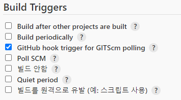
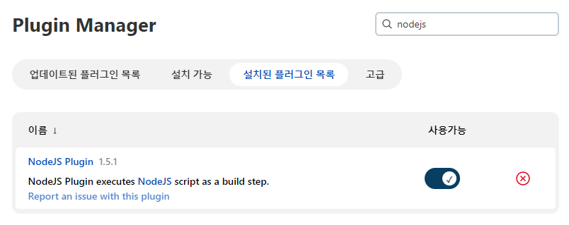

## 0. 서론
백엔드 배포가 끝났으니 프론트엔드를 배포하여 서비스를 시작 해야 한다.  
vue.js 를 젠킨스를 통해 S3 에 배포하는 방법을 정리한다.

## 1. pipeline 생성
백엔드에서는 free project 를 선택했다. 이 방법으론 GUI 를 통해 Job 을 설정하기 때문에 처음 접할땐 편리하지만 프로젝트가 많아지고 자동으로 관리하기엔 좋은 방법은 아닌것 같았다.  
그래서 아래 사진처럼 파이프라인을 생성했다. 파이프라인은 빌드과정을 코드를 통해 관리할 수 있다.

이제 몇가지 설정을 한뒤 스크립트를 작성하면 파이프라인이 테스트/빌드/배포를 자동으로 실행한다.

### 1.1 기본 설정
깃허브 저장소가 변경되면 파이프라인이 자동으로 실행되도록 설정한다.

## 2. 깃허브와 연결
가장먼저 깃허브와 연결해야 한다. SSK Key 를 생성하여 깃허브와 젠킨스에 각각 키를 등록하고 webhook 을 설정한다.  

자세한 방법은 다른 글에서 다뤘기 때문에 생략한다.

## 3. 스크립트 실행을 위한 설정
여기서 스크립트는 `테스트 -> 빌드 -> 배포` 과정을 정리한것이다. 이 각각의 과정을 위해 젠킨스에서 설정해야 하는것들이 있다.  

### 3.1 NodeJs 플러그인 설치
가장먼저 빌드를 위한 플러그인을 설치했다. 다음 사진처럼 `nodejs` 플러그인을 검색하여 설치한다.

### 3.2 git 설정
`[젠킨스 서버 IP]/configureTools/` 에서 Git 설정을 한다. 처음 젠킨스를 시작할때 `Install suggested plugins` 를 선택했다면 Git 플러그인은 기본적으로 설치되어 있을것이다.

Name 속성을 `git` 이라고 지정했는데 이것은 젠킨스의 git plugin 을 `git` 라는 이름으로 호출한다는 뜻이다.

### 3.3 nodejs 설정
젠킨스의 nodejs 플러그인은 여러개의 설정을 생성 할 수 있다. 일단은 개발시에 사용한 버전 하나만 추가하도록 한다.

330-nodejs-plugin-settings.png
## References
- [전체 절차](https://velog.io/@kimsehwan96/Jenkins-Github%EC%9D%84-%EC%9D%B4%EC%9A%A9%ED%95%9C-%EB%A6%AC%EC%95%A1%ED%8A%B8-%EC%95%B1-%EC%9E%90%EB%8F%99-%EB%B0%B0%ED%8F%AC-with-aws-S3)