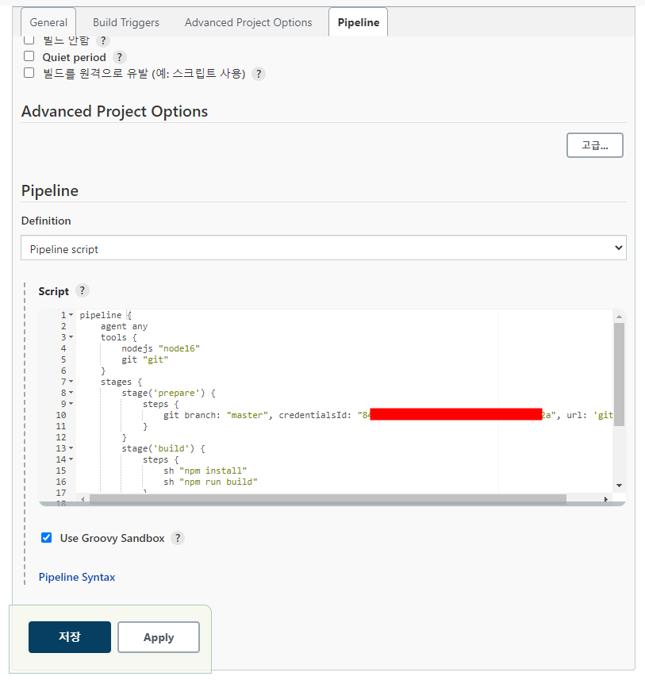
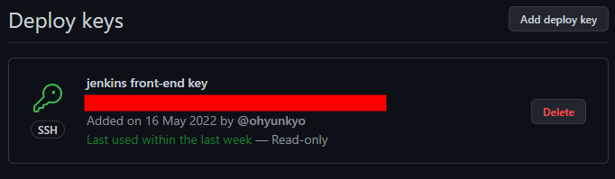
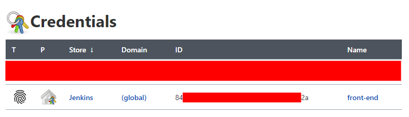

## 0. 서론
백엔드 배포가 끝났으니 프론트엔드를 배포하여 서비스를 시작 해야 한다.  
젠킨스를 통해 S3 에 vue.js 를 배포하는 방법을 정리한다.

## 1. pipeline 생성
백엔드를 배포 할 때에는 free project 를 선택했다. 이 방법으론 GUI 를 통해 Job 을 설정하기 때문에 처음 접할땐 편리하지만 프로젝트가 많아지고 자동으로 관리하기엔 좋은 방법은 아닌것 같았다.  
그래서 아래 사진처럼 파이프라인을 생성했다. 파이프라인은 빌드과정을 코드를 통해 관리할 수 있다.


이제 몇가지 설정을 한뒤 스크립트를 작성하면 파이프라인이 테스트/빌드/배포를 자동으로 실행한다.

### 1.1 기본 설정
깃허브 저장소가 변경되면 파이프라인이 자동으로 실행되도록 설정한다.


이후 아래 사진처럼 깃허브 저장소 설정에서 webhook 을 설정한다.


## 2. 파이프라인 스크립트 추가


이제 파이프라인 설정의 `pipeline` 탭에 아래의 스크립트를 추가한다.

```jenkinsfile
# 이 스크립트는 선언적 파이프라인 문법에 맞춰 작성했다.

pipeline {
    agent any
    tools {
        nodejs "node16"
        git "git"
    }
    stages {
        stage('prepare') {
            steps {
                git branch: "master", credentialsId: "[ID]", url: 'git@github.com:ohyunkyo/inventory-manage-front.git'                
            }
        }
        stage('build') {
            steps {
                sh "npm install"
                sh "npm run build"
            }
        }
        stage('deploy') {
            steps{
                sh "aws s3 sync ./dist s3://{버킷 이름} --delete"
            }
        }
    }
}
```

해당 스크립트는 빌드할 때에 실제로 젠킨스에서 실행될 작업들을 담고있다.  
이제 빌드가 정상적으로 실행되기 위해 해야 할 일들이 있다.

## 3. 파이프라인 스크립트 - tools
```jenkinsfile
tools {
    nodejs "node16"
    git "git"
}
```

`tools` 항목은 각각의 `stage` 에서 필요한 플러그인을 지정하는것이다.  
내가 작성한 스크립트에서는 `nodsjs` 와 `git` 을 포함하기 때문에 이것들을 위한 설정을 해줘야 한다.

`git` 은 git, `nodejs` 는 node16 이라는 이름으로 사용할 수 있도록 플러그인을 설정할것이다.

### 3.1 git 플러그인 설정<a id='3.1-git-플러그인-설정'></a>
`[젠킨스 서버 IP]/configureTools/` 에서 Git 설정을 한다. 처음 젠킨스를 시작할때 `Install suggested plugins` 를 선택했다면 Git 플러그인은 기본적으로 설치되어 있을것이다.


`git` 플러그인을 git 이라는 이름으로 사용하기로 했기 때문에 `Name` 속성을 git 이라고 지정한다.  
해당 플러그인을 git 이라는 이름으로 호출한다는 뜻인데, 지금상황에서 다른 이름으로 설정하면 에러가 발생한다.  

만약 `Path to Git executable` 옵션을 사용하거나 `installer` 를 추가하고 싶다면 `Add Git` 을 눌러 새로운 깃 설정을 추가하면 된다.

> git 이 아닌 git1 이라고 저장하고 빌드하면 다음 사진과 같은 에러가 발생.


### 3.2 NodeJs 플러그인 설치
`git` 플러그인과는 다르게 `nodejs` 플러그인은 직접 설치해야 한다. 다음 사진처럼 플러그인 관리에서 검색하여 설치한다.


### 3.3 NodeJs 플러그인 설정
`nodejs` 플러그인도 `git` 플러그인과 마찬가지로 여러개의 설정을 생성 할 수 있다. 일단은 개발시에 사용한것과 동일한 버전 하나만 추가하도록 한다.


이름과 원하는 버전을 선택한다.  

`Global npm packages to install` 항목에는 각 프로젝트에서 개별적으로 설치하는 패키지가 아닌, 전역적으로 설치되어 있어야 하는 패키지 이름을 적어준다.  
내 프로젝트에선 이런 패키지가 없기때문에 비워뒀다.

## 4. 파이프라인 스크립트 - stages
`stages` 는 대부분의 작업이 위치하는 장소이며, 하나 이상의 `stage` 를 포함해야 한다.
```jenkinsfile
stages {
    stage('prepare') {
        steps {
            git branch: "master", credentialsId: "[id]", url: 'git@github.com:ohyunkyo/inventory-manage-front.git'                
        }
    }
    stage('build') {
        steps {
            sh "npm install"
            sh "npm run build"
        }
    }
    stage('deploy') {
        steps{
            sh "aws s3 sync ./dist s3://{버킷 이름} --delete"
        }
    }
}
```

모든 파이프라인이 이와 같이 세단계로 이루어져 있는것은 아니지만 파이프라인에 대해 잘 모른다면 이런식으로 시작하는것이 좋다. 이후 필요에 따라 이름을 변경하거나 새로운 단계를 추가하면 된다.

이 스크립트에서는 `stage` 를 `prepare`, `build`, `deploy` 로 나누었는데, 아래 사진처럼 각각의 `stage` 성공 여부를 젠킨스에서 확인할 수 있다.


### 4.1 stage - prepare
```jenkinsfile
stage('prepare') {
    steps {
        git branch: "master", credentialsId: "[id]", url: 'git@github.com:ohyunkyo/inventory-manage-front.git'                
    }
}
```

각 `stage` 내부의 `steps` 블록은 각각의 `step` 들을 묶어주는 역할을 한다.  
여기에선 `steps` 블록 내부의 `git` 이 하나의 `step` 인데,  
[아까](#3.1-git-플러그인-설정) 깃 설정을 `git` 이라는 이름으로 만들었기 때문에 젠킨스 파이프라인 스크립트에서 `git step` 을 사용할 수 있게 되는것이다.

### 4.1.1 깃허브와 연결
`prepare stage`에선 `git step` 을 통해 깃허브 저장소에서 소스코드를 가져오는 작업을 한다.  
내가 가져오려는 깃허브 저장소의 경우 비공개이기 때문에 SSH Key 를 통한 인증이 필요하다.  
이 Key 를 생성하여 깃허브와 젠킨스에 각각 키를 등록해야 하는데, 자세한 방법은 다른 글에서 다뤘기 때문에 생략한다. 최종적으로 아래 사진처럼 되면 된다.





### 4.1.2 git step 인자 설정
기본적으로 `git step` 이 비공개 저장소에서 소스코드를 가져오기 위한 인자를 다음과 같이 설정한다.
- `branch` : 가져오려는 브랜치 이름. 
- `credentialsId` : 젠킨스에 등록한 credential 의 ID. Name 을 사용하면 안된다. 
- `url` : 깃허브 저장소의 주소. HTTPS 가 아닌 SSH 를 선택해서 복사 한것을 붙여넣으면 된다.

## 4.2 stage - build
```jenkinsfile
stage('build') {
    steps {
        sh "npm install"
        sh "npm run build"
    }
}
```

`build stage` 에서는 `sh step`(쉘 스크립트 실행) 을 통해 `npm` 명령어를 실행한다.  
만약 `nodejs` 플러그인 설정이 제대로 되지 않았다면 이 단계에서 문제가 생기므로 에러가 출력될 경우 해당 플러그인 설정을 확인하면 된다.

결과적으론 `npm` 명령어들이 실행되고 `./dist` 디렉토리에 정적 파일을 생성한다. 이 디렉토리를 S3 에 배포하면 되는것이다.

## 4.3 stage - deploy
```jenkinsfile
stage('deploy') {
    steps{
        sh "aws s3 sync ./dist s3://{버킷 이름} --delete"
    }
}
```

마찬가지로 `sh step` 을 통해 명령어를 실행한다.   
`aws s3 sync` 명령어는 디렉토리와 S3 버킷을 동기화 한다. 원본 디렉토리에서 목적지로 새로운 파일 및 업데이트 된 파일을 복사하는것이다. 

각각의 인자 및 옵션의 의미는 다음과 같다
- `./dist` : 원본 파일의 경로.
- `s3://{버킷 이름}` : 목적지 버킷의 이름.
- `--delete` : 목적지에는 있지만 원본에 없는 파일의 경우 삭제하도록 하는 옵션.

[aws s3 sync 명령어 매뉴얼](https://awscli.amazonaws.com/v2/documentation/api/latest/reference/s3/sync.html)

이 명령어도 제대로 실행되기 위해 몇가지 설정이 필요하다.

### 4.3.1 S3 버킷 생성
가장먼저 아마존 S3 서비스에서 배포된 파일이 위치할 버킷을 생성한다. 이후 다음과 같이 설정해준다.

1. 속성 탭에서 해당 버킷을 웹 사이트로 호스팅 하기 위한 설정을 한다.


2. 권한 탭에서 해당 버킷을 외부에서 접속 가능하도록 하기 위한 설정을 한다.


```json
{
    "Version": "2012-10-17",
    "Statement": [
        {
            "Sid": "ReadOnly",
            "Effect": "Allow",
            "Principal": "*",
            "Action": "s3:GetObject",
            "Resource": "arn:aws:s3:::{버킷 이름}/*"
        }
    ]
}
```

### 4.3.2 aws cli 설치
이 `aws cli` 는 실제 젠킨스 서비스가 있는 컨테이너에 설치 되어야 한다.  
먼저 젠킨스 서버에서 젠킨스 서비스 컨테이너의 쉘을 실행한다. 
```shell
$ sudo docker exec -it jenkins_cicd /bin/bash
```
이후 `home` 디렉토리로 이동하여 설치파일을 다운로드 하고 실행한다.
```
# cd 
# curl "https://awscli.amazonaws.com/awscli-exe-linux-x86_64.zip" -o "awscliv2.zip"
# unzip awscliv2.zip
# ./aws/install
```

아래의 명령어가 실행된다면 정상적으로 설치된것이다. 만약 정상적으로 설치되지 않았다면 [여기](https://docs.aws.amazon.com/ko_kr/cli/latest/userguide/getting-started-install.html) 를 눌러 공식 문서를 참고하자. 
```
# aws --version
```

### 4.3.3 aws 인증 정보
버킷도 생성했고 `aws` 명령어도 사용할 수 있게 되었다. 그러나 아직 끝이 아니다. 젠킨스가 해당 버킷에 대한 인증 정보를 가지고 있어야 파일을 업로드 할 수 있다.  
쉽게 말하자면 로그인 해야 한다는 뜻이다.

`aws configure` 명령어를 입력하면 다음과 같이 인증 정보를 물어본다. 


위 사진은 인증 정보를 입력 후 명령어를 다시 실행한 것인데, 처음이라면 다음과 같이 인증 정보를 발급받아 입력하면 된다.

1. AWS 콘솔에 로그인 한 후 우측 상단에서 AWS 아이디 클릭
2. 보안 자격 증명 메뉴 클릭

  

3. 새 엑세스 키 만들기 버튼 클릭하여 인증 정보 생성


버튼을 클릭하면 아래 사진처럼 액세스 키가 바로 생성된다. 설명에도 나와있지만 이렇게 생성된 키의 비밀 키는 생성시에만 볼 수 있기 때문에 다운로드 하여 보관하는것이 좋다.


이제 `aws configure` 명령어를 다시 실행하고 발급된 키의 ID 와 시크릿 키를 입력한다.  
`Default region name` 은 버킷을 생성한 리전 이름을 입력한다.    
`Default output format` 은 그대로 공백을 유지해도 문제 없다.

## 5. 파이프라인 빌드하기
이렇게 모든 설정이 완료되었다면 파이프라인을 빌드한다.  


이후 위 사진처럼 모든 `stage` 가 성공적으로 완료 되었다면 버킷 웹 사이트 엔드포인트로 접속하여 사이트를 확인한다.  
엔드포인트는 정적 웹 사이트 호스팅 탭에서 확인 가능하다.


이 주소를 엔드포인트에 붙여 넣었을때 웹페이지가 정상적으로 나온다면 성공한것이다.


## 99. 끝나고 나서
젠킨스 파이프라인에서는 스크립트만 있으면 되기 때문에 굉장히 편해보인다.  
하지만 그 스크립트를 실행하기 위해 설치해야 할것들이 꽤나 많았다. 거기다 젠킨스 서비스 컨테이너를 재시작 하면 이런 작업을 처음부터 다시 해야 하기 때문에 비효율적이다.  
이런 작업을 수동으로 하지 않아도 되도록 내가 필요한 패키지들이 설치 되어 있는 이미지를 만들어 두면 좋을것 같다. 

## References
- [전체 절차](https://velog.io/@kimsehwan96/Jenkins-Github%EC%9D%84-%EC%9D%B4%EC%9A%A9%ED%95%9C-%EB%A6%AC%EC%95%A1%ED%8A%B8-%EC%95%B1-%EC%9E%90%EB%8F%99-%EB%B0%B0%ED%8F%AC-with-aws-S3)