## 0. 서론
지금 온라인중인 서비스는 `django` 로만 만들어져 있다.
개발 수정사항을 깃허브에 푸쉬 하면 운영서버에서 저장소의 소스코드를 수동으로 가져와야 한다. 

소스코드를 리팩토링 하는 과정에서 프론트와 백엔드 구분을 위해 `vue.js` / `django` 구조로 변경했고, 수동으로 소스코드를 가져오는 불편함을 해소하기 위해 젠킨스를 사용한 CI/CD 를 도입하기로 결정했다. 또한 백엔드는 도커 컨테이너를 통해 제공하고, 프론트는 S3 를 통해 배포하기로 결정했다.
```
# 최종 목표 기술 스택 
 
front-end : vue.js / S3
back-end : django / docker on EC2
db : rds(mysql)
CI/CD : jenkins
```

프론트와 백엔드 구분은 이미 완료했고 이후 젠킨스를 통해 백엔드를 배포 하는 과정을 정리했다. 이 과정에서 사용한 배포 프로세스는 다음 사진과 같다.

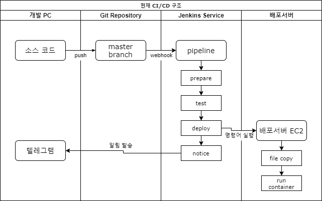

## 1. 젠킨스 서버 구성
```
# EC2 스펙

AMI : amzn2-ami-kernel-5.10-hvm-2.0.20220426.0-x86_64-gp2
인스턴스 유형 : t3.small
```
EC2 인스턴스를 하나 생성했다. 젠킨스에서 사용할 포트(여기에선 80 을 사용)를 열어주기만 하면 크게 신경 쓸 것은 없다.

방금 만든 것을 젠킨스 서버라고 부르기로 하자.

## 2. 젠킨스 서버에서 jenkins 서비스 실행<a id='2.-젠킨스-서버에서-jenkins-서비스-실행'></a>
젠킨스 서버에 jenkins 서비스를 올릴것이다. 도커를 사용하면 좀더 편하게 서비스를 제공할 수 있다.

도커를 처음 사용한다면 개별적으로 설치하고 설정해줘야 할게 많다고 느껴질 수 있다.  
나도 그렇게 생각했기 때문에 젠킨스 서비스를 간편하게 실행할 수 있도록 간단한 쉘 스크립트를 작성했다.    
아래 파일의 내용을 `/home/ec2-user/jenkins_server_settings.sh` 파일에 붙여넣는다.

```shell
# jenkins_server_settings.sh

# docker install
sudo yum update -y
sudo amazon-linux-extras install -y docker -y
sudo systemctl start docker
sudo systemctl enable docker

# docker compose install
sudo curl -SL https://github.com/docker/compose/releases/download/v2.4.1/docker-compose-linux-x86_64 -o /usr/local/bin/docker-compose
sudo chmod +x /usr/local/bin/docker-compose
sudo ln -s /usr/local/bin/docker-compose /usr/bin/docker-compose

# directory for jenkins service
mkdir -p jenkins_config

# creating django module installer
echo "apt-get update -y
apt-get install -y
apt-get install docker.io -y
apt-get install python3 pip -y
pip install django==3.2.6

apt-get install python3-dev default-libmysqlclient-dev build-essential -y" > /home/ec2-user/jenkins_config/django_module_installer.sh

sudo chmod +x ./jenkins_config/django_module_installer.sh

# creating docker-compose.yml file
echo "version: '3'

services:
    jenkins:
        image: jenkins/jenkins:lts
        container_name: jenkins_cicd
        volumes:
            - /var/run/docker.sock:/var/run/docker.sock
            - /home/ec2-user/jenkins_home:/var/jenkins_home
            - /home/ec2-user/jenkins_config/django_module_installer.sh:/var/jenkins_home/scripts/django_module_installer.sh
        ports:
            - \"80:8080\"
        privileged: true
        user: root
        secrets:
            - django_secret
        command: sh -c \"/var/jenkins_home/scripts/django_module_installer.sh && /sbin/tini -- /usr/local/bin/jenkins.sh\"
	
secrets:
    django_secret:
        file: /home/ec2-user/secrets/django_secret.json" > /home/ec2-user/jenkins_config/docker-compose.yml

# container up
sudo docker-compose -f /home/ec2-user/jenkins_config/docker-compose.yml up -d
```

먼저 각각의 주석을 상세히 설명하자면 다음과 같다
1. `docker install` : 도커 패키지를 설치하고 인스턴스 재시작시 도커가 실행되도록 했다.
2. `docker compose install` : `docker-compose` 명령어 사용을 위해 패키지를 설치하고 심볼릭 링크를 걸어줬다.
3. `directory for jenkins service` : 젠킨스 서비스를 위한 설정파일이 위치할 디렉토리를 생성했다.
4. `creating django module installer` : 파이프라인 빌드시 장고 프로젝트 테스트를 위한 패키지를 설치하는 쉘을 작성했다.
5. `creating docker-compose.yml file` : 실제로 컨테이너가 생성될 때 사용될 설정파일을 생성한다.
6. `container up` : `docker-compose.yml` 파일을 사용하여 컨테이너를 생성한다.

이제 이 `jenkins_server_settings.sh` 파일을 실행한다.

```shell
$ sh jenkins_server_settings.sh
```

이러면 `docker-compose.yml` 파일 내용을 참조한 젠킨스 컨테이너가 생성되었다.  
`command` 옵션에서 `django_module_installer.sh` 를 실행하여 장고를 위한 패키지를 설치했고 그 다음엔 젠킨스 서비스 시작을 위한 쉘스크립트를 실행했다.  
이제 브라우저에 젠킨스 서버 IP 를 입력하면 젠킨스 서비스 화면을 확인해 볼 수 있다.

## 3. jenkins 설정하기
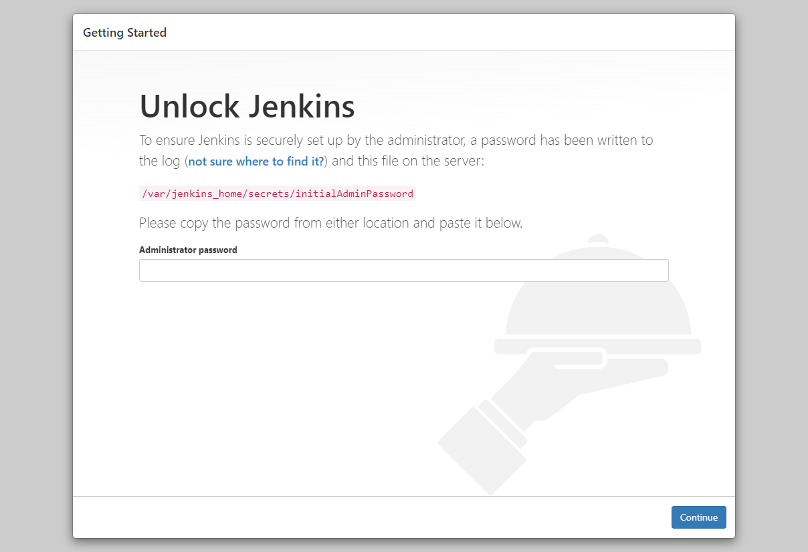

젠킨스를 시작하기 위해서는 암호가 필요하다. 이 암호는 이미 생성된 상태인데, 아래의 명령어를 사용하여 확인 가능하다
```shell
$ sudo docker-compose -f /home/ec2-user/jenkins_container_config/docker-compose.yml logs
```

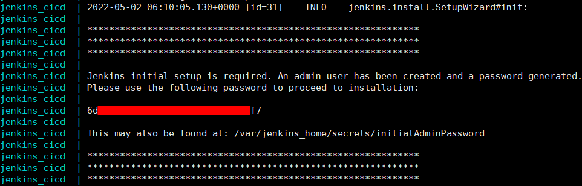

이 비밀번호를 입력하고 들어가면 기본적인 설정을 해야한다. 실제로 할것은 크게 없고 다음으로 넘어가기만 하면 된다.

### 3.1 플러그인 설치<a id='3.1-플러그인-설치'></a>
`Install suggested plugins` 은 가장 유용한 플러그인을 알아서 설치해준다. 젠킨스가 익숙하지 않다면 이 옵션을 사용하자.

  


### 3.2 계정 생성
설치가 완료되면 계정을 생성해야 한다. 이후 젠킨스에 로그인 할 때에는 이 계정을 사용한다.


### 3.3 URL 설정
젠킨스 url 설정하는 부분. 잘 모르는 부분이라 건들지 않고 넘겼다.

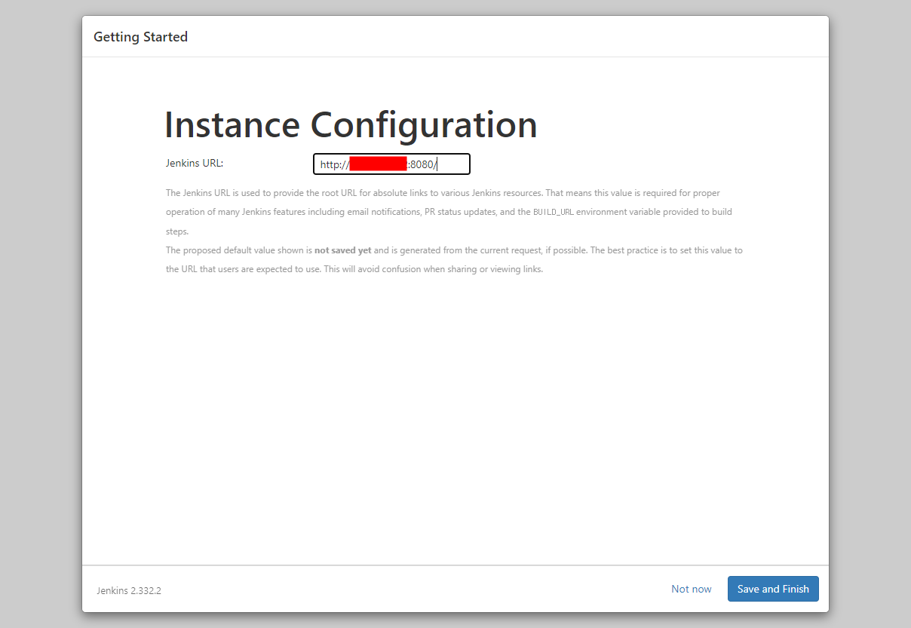

### 3.4 완료
완료되었다!!


### 3.5 메인화면 확인
내가 확인한 젠킨스 메인화면

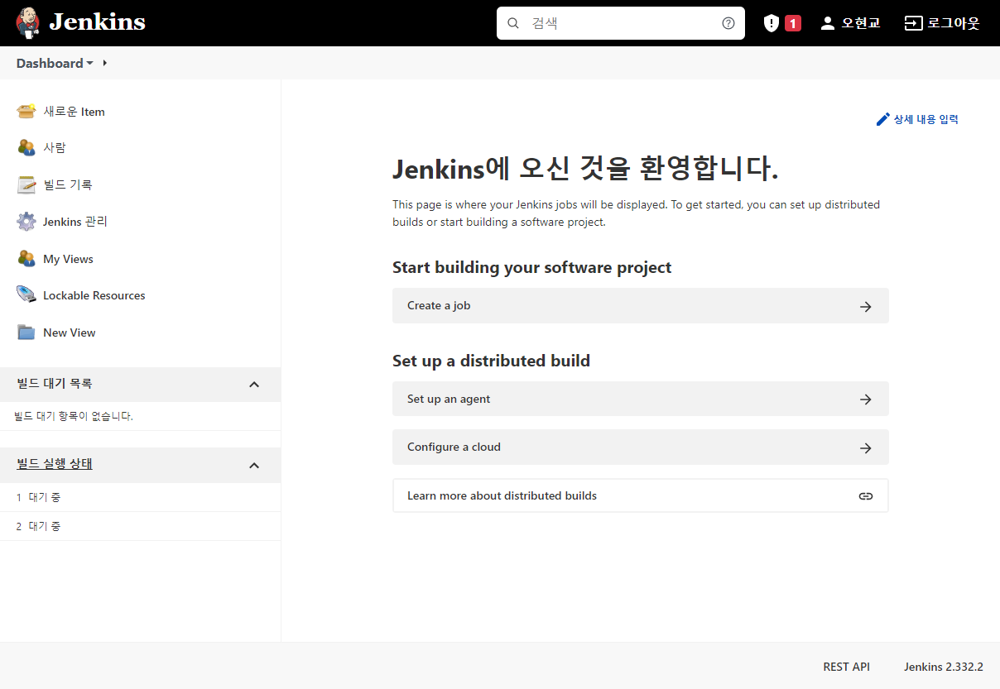

이제 본격적으로 젠킨스를 활용해보자.

## 4. pipeline 생성 및 설정
젠킨스의 `pipeline` 은 여러 작업들을 하나로 묶어서 관리할 수 있도록 해준다.  
깃허브 저장소의 소스코드를 가지고와서 빌드와 테스트를 진행한 후 배포하는 과정을 하나로 묶어서 자동화하도록 도와준다는것이다.  

이 `pipeline` 을 생성하고 기본적인 설정을 해주자.

### 4.1 pipeline 생성
아래 사진처럼 좌측 메뉴에서 `새로운 Item` 을 클릭 후 여러 종류의 프로젝트 중 `pipeline` 을 선택하여 생성한다.

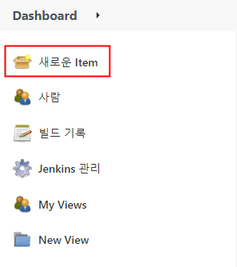

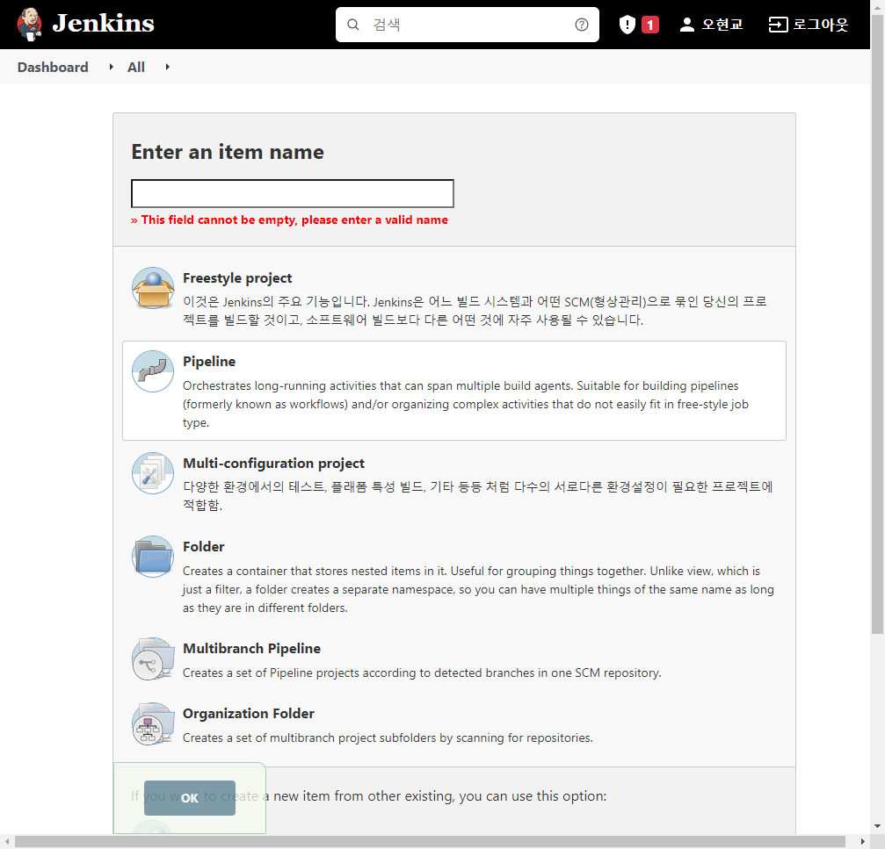

### 4.2 pipeline 일반 설정
이제 파이프라인을 설정한다.  
`General` 탭에서는 `github project` 옵션을 선택한다. 여기에 깃허브 저장소 주소를 적어주면 된다.  
`Build Triggers` 탭에서 `GitHub hook trigger for GITScm polling` 옵션을 선택하면 깃허브에서 보낸 웹훅을 수신했을 때 자동으로 빌드를 시작한다.

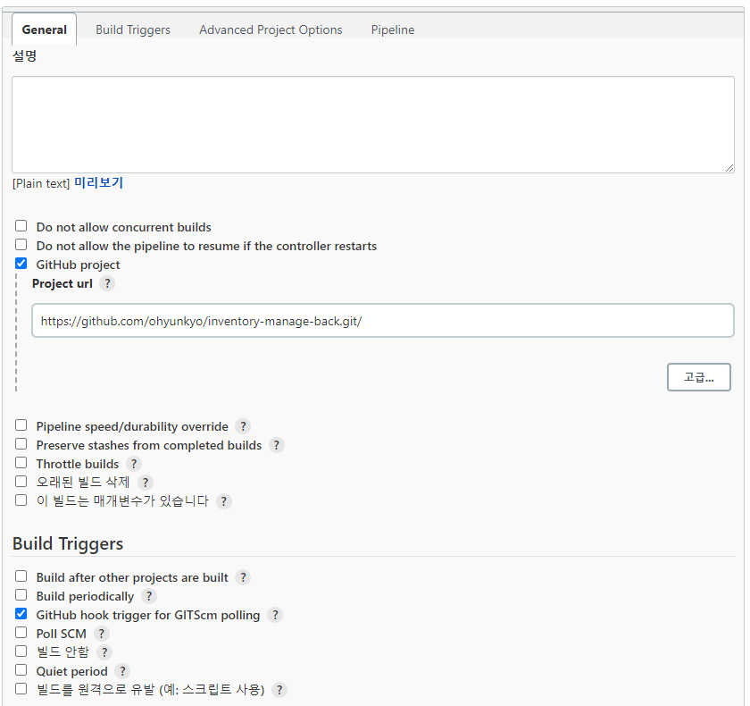
 
### 4.3 pipeline script 작성
마지막으로 파이프라인 안에서 어떤 작업을 실행할지를 정해줘야 한다. `Freestyle project` 에서는 이를 GUI 화면에서 입력했는데, `pipeline` 에서는 스크립트를 통해서 정할 수 있다.

> `pipeline script` 가 아닌 `pipeline script from SCM` 을 선택하면 깃허브 저장소에 있는 스크립트를 사용할 수 있다.

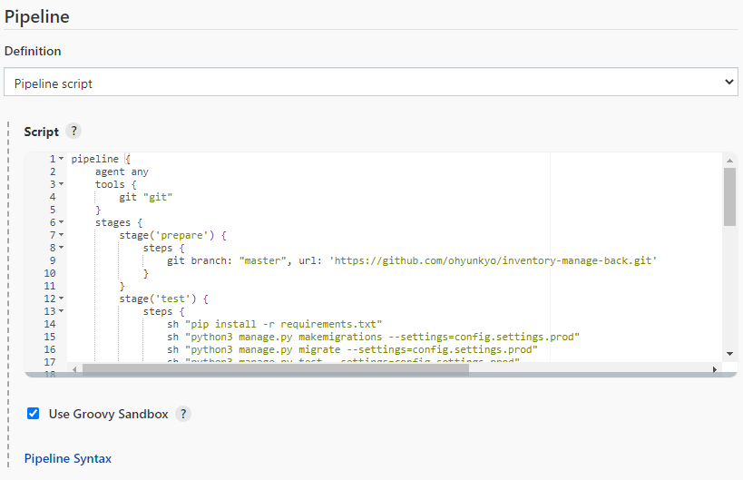

`pipeline` 탭을 선택하여 아래의 스크립트를 붙여넣는다.

```jenkinsfile
pipeline {
    agent any
    tools {
        git "git"
    }
    stages {
        stage('prepare') {
            steps {
                git branch: "master", url: 'https://github.com/ohyunkyo/inventory-manage-back.git'
            }
        }
        stage('test') {
            steps {
                sh "pip install -r requirements.txt"
                sh "python3 manage.py makemigrations --settings=config.settings.prod"
                sh "python3 manage.py migrate --settings=config.settings.prod"
                sh "python3 manage.py test --settings=config.settings.prod"
            }
        }
        stage('deploy') {
            steps([$class: 'BapSshPromotionPublisherPlugin']) {
                sshPublisher(
                    continueOnError: false, failOnError: true,
                    publishers: [
                        sshPublisherDesc(
                            configName: "inventory backend",
                            verbose: true,
                            transfers: [
                                sshTransfer(
                                    sourceFiles: "**",
                                    removePrefix: "",
                                    remoteDirectory: "deploys",
                                    execCommand:"cd /home/ec2-user/deploys/; \
                                    sudo docker-compose up -d; "
                                )
                            ]
                        )
                    ]
                )
            }
        }
    }
    post {
        always {
    	    notifyEvents (
    	        token: "notify.events token",
    	        message: "<a href='${env.JOB_URL}'>${env.JOB_NAME}</a>: #<a href='${env.BUILD_URL}'>${env.BUILD_NUMBER}</a> 에 대한 결과: <b>${currentBuild.result}</b><br/><br/><a href='${env.BUILD_URL}console'>로그(console)</a>"
    	    )
        }
    }
}
```

> pipeline script 의 전체적 문법은 [여기](/devops/deploy-vue-with-jenkins/) 에서 간략히 설명했다.

나는 `prepare`, `test`, `deploy` 로 단계를 나눴다. `prepare stage` 에서는 깃허브 저장소에서 소스코드를 가져오고, `test stage` 에서 소스코드를 테스트한다.  
그 다음 `Publish Over SSH` 플러그인을 사용하여 소스코드를 배포서버에 업로드하고 컨테이너를 실행한다.

이 작업들이 모두 완료되었다면 내가 지정한대로 `notify.events` 플러그인을 사용하여 알림을 전송한다.

이제 파이프라인 스크립트가 정상적으로 작동하도록 따로 설정해줘야 할 것들이 있다.

## 5. github webhook 설정<a id='5-github-webhook-설정'></a>
웹훅을 받는곳에선 설정이 완료되었지만 보내는곳에선 설정해주지 않았다. github 저장소에서 웹훅을 전달할 주소를 지정해야 한다.  

> [3.1](#3.1-플러그인-설치) 에서 `Install suggested plugins` 를 선택했다면 이미 플러그인이 설치 되어 있는 상태이기 때문에 웹훅 기능을 바로 사용할 수 있다.

`https://github.com/[username]/[reponame]/settings/hooks/new`

위의 경로로 들어가서 다음 사진과 같이 Payload URL 에 `[젠킨스 서버 IP]/github-webhook/` 을 입력후 추가한다.  
기본 옵션이 push 이벤트만 알리도록 하는것인데 지금 당장은 다른 이벤트 알림은 필요 없기 때문에 따로 설정할건 없다.

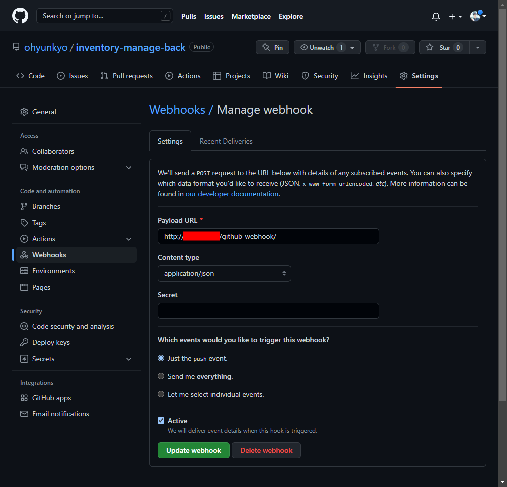

그 다음엔 정상적으로 연결되었는지 확인한다. 만약 초록섹 체크 표시가 아니라면 젠킨스 서버 EC2 인스턴스의 SG 등 보안 설정을 확인해보자.  
만약 보안 설정이 문제 없는데도 커넥션이 정상적이지 않다면 새로고침만 계속 누르지 말고 삭제 후 다시 등록하자.  

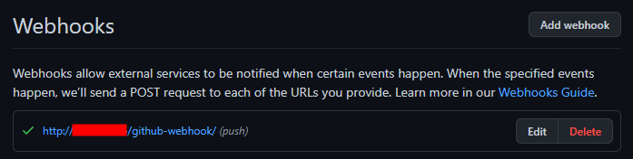

> `Let me select individual events.` 를 선택하면 거의 모든 이벤트(포크, Key 추가 등)에서 웹훅 트리거를 작동 시킬 수 있는것같다.

## 6. Publish Over SSH
젠킨스 서버에서 SSH 로 배포서버에 접속해 배포를 진행하기 때문에 관련 플러그인을 설치해야 한다.  
아래 사진처럼 Publish Over SSH 를 설치한다.

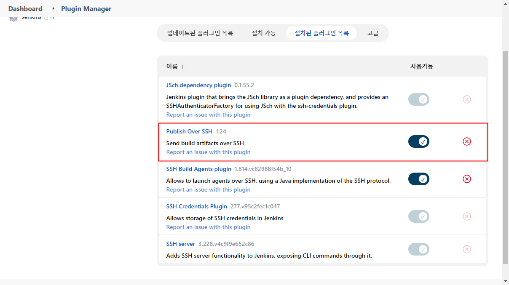

Publish Over SSH 은 젠킨스에서 원격서버에 접속할 수 있는 플러그인이다.  
공식 문서(https://plugins.jenkins.io/publish-over-ssh/) 를 대충 번역하자면  
SSH 를 통한 파일 전송, 원격 서버에서 명령 실행, username/password 와 공용 키를 사용한 인증 등 여러 기능을 제공한다.

### 6.1 배포서버 SSH 접속정보 등록<a id='6.1-배포서버-SSH-접속정보-등록'></a>
이 플러그인을 사용하기 위해 배포서버의 SSH 접속정보를 젠킨스에 등록해야 한다.
젠킨스 관리 - 시스템 설정(`[젠킨스 서버 IP]/configure`) 으로 이동해서 Publish over SSH 부분을 채워준다.

각 항목을 설명하자면 다음과 같다
- `Passphrase` : 개인 키가 암호화 되어 있을 경우 암호를 적는다.
- `Path to key` : 개인 키가 젠킨스 서버에 있을 경우 경로를 적는다.
- `Key` : 개인키 파일의 내용을 입력한다.
- `SSH Servers` : 원격서버의 정보를 입력한다.
    - `Name` : 원격서버 설정에 대한 이름이다.
    - `Hostname` : 원격서버의 호스트명이다. hostname 또는 IP 를 입력한다.
    - `Username` : 원격서버에 접속하기 위한 유저 이름이다.
    - `Remote Directory` : 이 설정의 기본 디렉토리. 반드시 존재하는 디렉토리여야 하며, 이 디렉토리 내에만 파일을 전송할 수 있다.

나는 아래 사진처럼 등록했다.

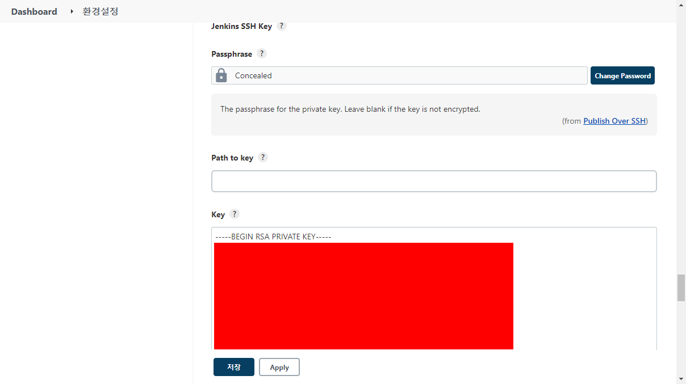

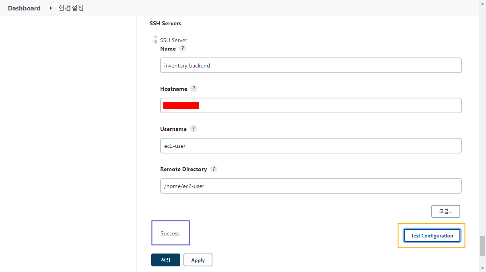

정보 입력 후 Test Configuration 버튼(주황색 상자)을 누르면 현재 SSH 정보로 원격서버에 연결하여 테스트 할 수 있다.  
정상적이라면 파란색 상자 안에 보이는 것처럼 `Success` 라는 문자열을 출력한다.

## 7. 결과 확인하기
이제 파이프라인을 빌드하고 배포가 정상적으로 되는지 확인할것이다.

### 7.1 빌드 확인하기
파이프라인을 빌드하기 위해 로컬 PC 에서 작성한 소스코드 변경 사항을 저장소의 `master branch` 에 `push` 한다.  
그러면 아래 사진처럼 젠킨스에서 새로운 빌드가 시작된다.(이번에 못찍어서 저번에 찍은 사진으로 대체)


이렇게 시작된 빌드는 깃허브의 `push` 로 시작된 빌드라는 로그가 남아있다.  

> 이 별것도 아닌걸 위해서 지금까지 그렇게 고생했다니..

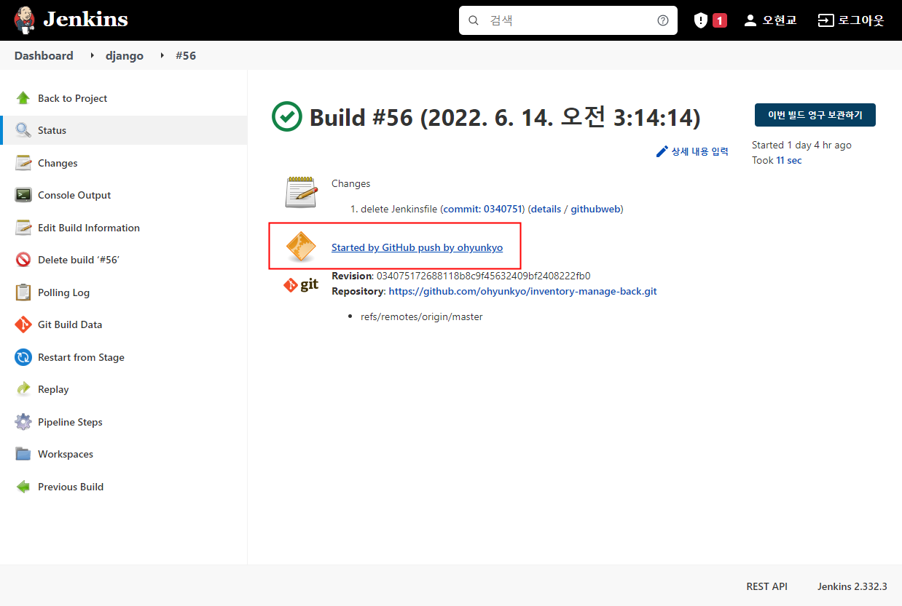

아래 사진은 젠킨스에서 수동으로 실행한 빌드이다.

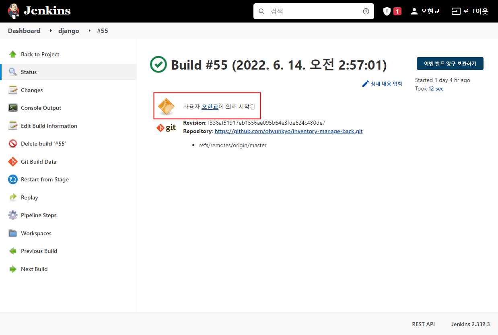

### 7.2 배포서버 확인하기
빌드의 마지막 스테이지인 `deploy` 는 배포서버에서 컨테이너를 실행하는 부분을 포함하고 있다. 이번 빌드가 에러 없이 잘 완료되었기 때문에 배포서버에서 컨테이너가 정상적으로 실행되었고, 서비스가 돌아가고 있다고 기대해 볼 수 있다.  

배포서버에서 `sudo docker ps -a` 명령어를 실행하여 컨테이너 목록을 확인해보자.

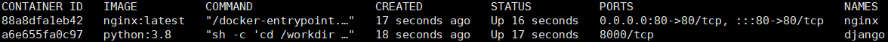

컨테이너는 잘 실행되었다. 이제 브라우저에서 확인해보자.

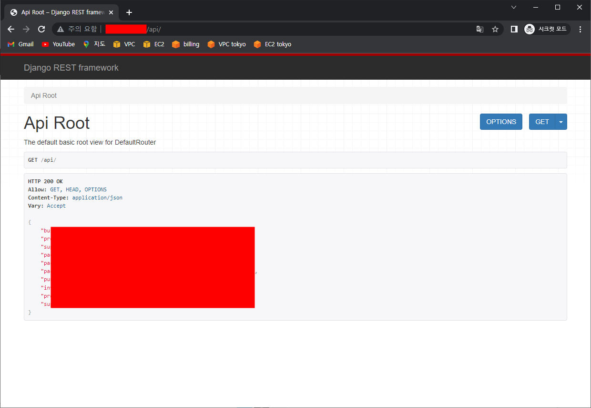

끝~~!!!!!!!!!!!!

## References
[파이프라인 스크립트에서 publish over ssh 사용](https://velog.io/@soover/CICD-Jenkins-%EA%B0%9C%EB%B0%9C-%EC%84%9C%EB%B2%84%EB%A5%BC-%EC%9C%84%ED%95%9C-%EB%B0%B0%ED%8F%AC-%ED%99%98%EA%B2%BD-%EB%A7%8C%EB%93%A4%EA%B8%B0-Pipeline)

[깃허브 웹훅](https://alsyean.tistory.com/57)
