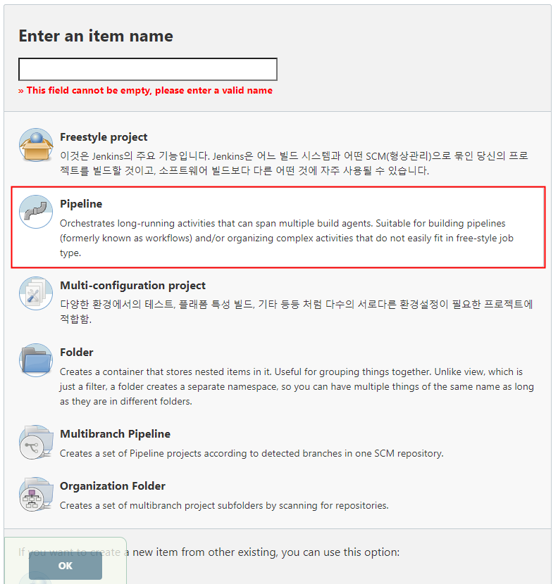
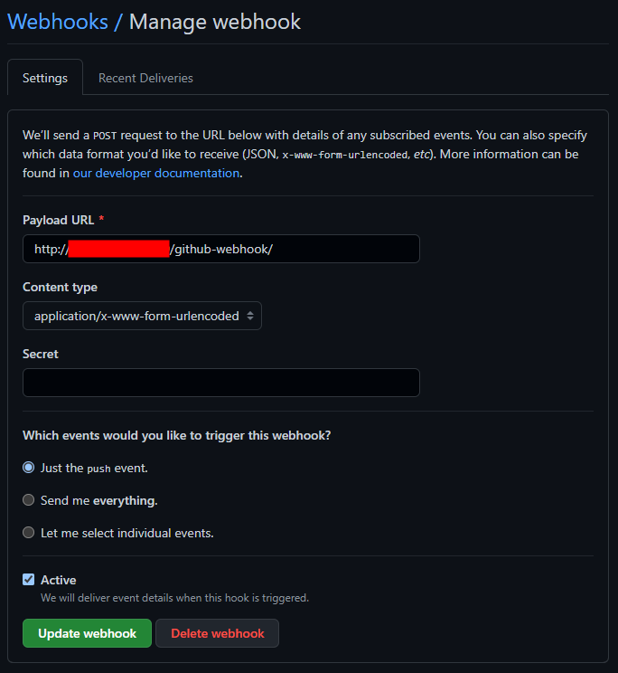
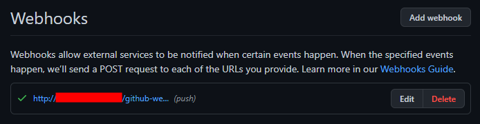
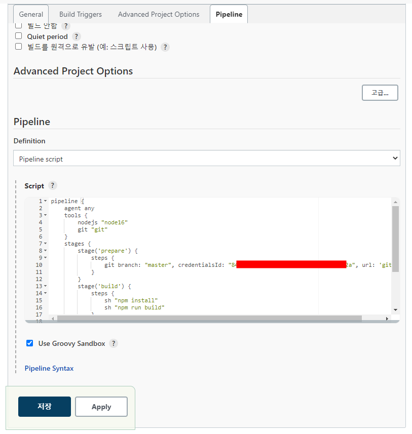
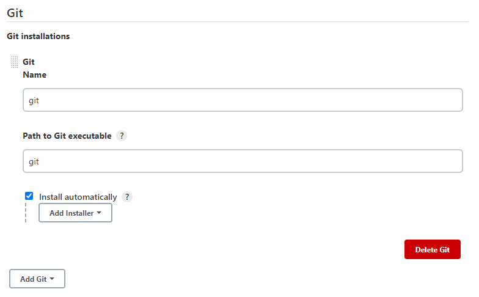
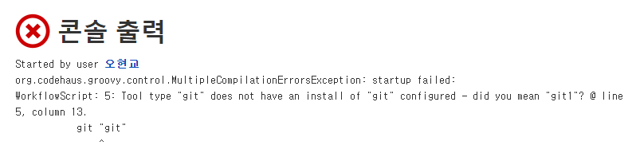
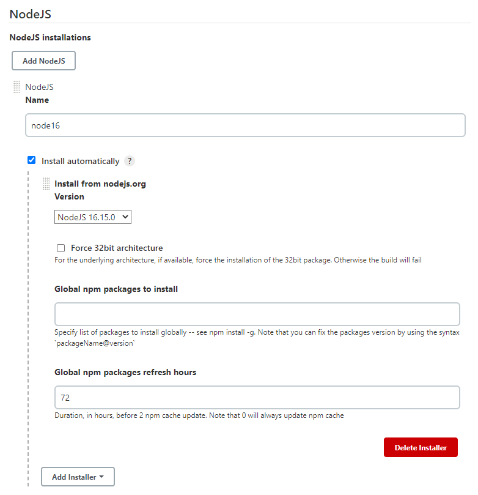
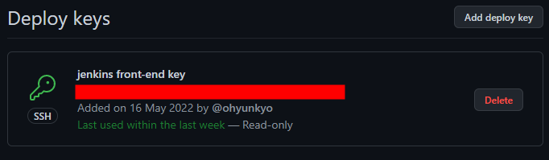
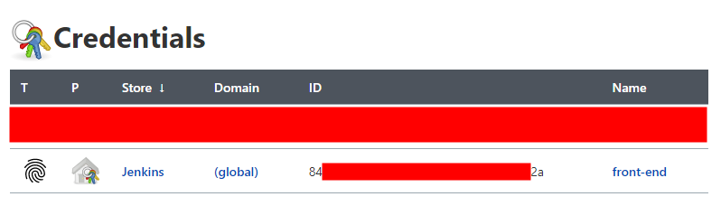

## 0. 서론
백엔드 배포가 끝났으니 프론트엔드를 배포하여 서비스를 시작 해야 한다.  
vue.js 를 젠킨스를 통해 S3 에 배포하는 방법을 정리한다.

## 1. pipeline 생성
백엔드에서는 free project 를 선택했다. 이 방법으론 GUI 를 통해 Job 을 설정하기 때문에 처음 접할땐 편리하지만 프로젝트가 많아지고 자동으로 관리하기엔 좋은 방법은 아닌것 같았다.  
그래서 아래 사진처럼 파이프라인을 생성했다. 파이프라인은 빌드과정을 코드를 통해 관리할 수 있다.



이제 몇가지 설정을 한뒤 스크립트를 작성하면 파이프라인이 테스트/빌드/배포를 자동으로 실행한다.

### 1.1 기본 설정
깃허브 저장소가 변경되면 파이프라인이 자동으로 실행되도록 설정한다.


이후 아래 사진처럼 깃허브 저장소 설정에서 webhook 을 설정한다.





## 2. 파이프라인 스크립트 추가


이제 파이프라인 설정의 `pipeline` 탭에 아래의 스크립트를 추가한다.

```jenkinsfile
# 이 스크립트는 선언적 파이프라인 문법에 맞춰 작성했다.

pipeline {
    agent any
    tools {
        nodejs "node16"
        git "git"
    }
    stages {
        stage('prepare') {
            steps {
                git branch: "master", credentialsId: "[ID]", url: 'git@github.com:ohyunkyo/inventory-manage-front.git'                
            }
        }
        stage('build') {
            steps {
                sh "npm install"
                sh "npm run build"
            }
        }
        stage('deploy') {
            steps{
                sh "aws s3 sync ./dist s3://inventory-front --delete --profile default"
            }
        }
    }
}
```

해당 스크립트는 빌드할 때에 실제로 젠킨스에서 실행될 작업들을 담고있다.  
이제 빌드가 정상적으로 실행되기 위해 해야 할 일들이 있다.

## 3. 파이프라인 스크립트 - tools
```jenkinsfile
tools {
    nodejs "node16"
    git "git"
}
```

`tools` 항목은 각각의 `stage` 에서 필요한 플러그인을 지정하는것이다.  
내가 작성한 스크립트에서는 `nodsjs` 와 `git` 을 포함하기 때문에 이것들을 위한 설정을 해줘야 한다.

`git` 은 git, `nodejs` 는 node16 이라는 이름으로 사용할 수 있도록 플러그인을 설정할것이다.

### 3.1 git 플러그인 설정<a id='3.1-git-플러그인-설정'></a>
`[젠킨스 서버 IP]/configureTools/` 에서 Git 설정을 한다. 처음 젠킨스를 시작할때 `Install suggested plugins` 를 선택했다면 Git 플러그인은 기본적으로 설치되어 있을것이다.



`git` 플러그인을 git 이라는 이름으로 사용하기로 했기 때문에 `Name` 속성을 git 이라고 지정한다.  
해당 플러그인을 git 이라는 이름으로 호출한다는 뜻인데, 지금상황에서 다른 이름으로 설정하면 에러가 발생한다.  

만약 `Path to Git executable` 옵션을 사용하거나 `installer` 를 추가하고 싶다면 `Add Git` 을 눌러 새로운 깃 설정을 추가하면 된다.

> git 이 아닌 git1 이라고 저장하고 빌드하면 다음 사진과 같은 에러가 발생.



### 3.2 NodeJs 플러그인 설치
`git` 플러그인과는 다르게 `nodejs` 플러그인은 직접 설치해야 한다. 다음 사진처럼 검색하여 설치한다.


### 3.3 NodeJs 플러그인 설정
`nodejs` 플러그인도 `git` 플러그인과 마찬가지로 여러개의 설정을 생성 할 수 있다. 일단은 개발시에 사용한 버전 하나만 추가하도록 한다.



이름과 원하는 버전을 선택한다.  

`Global npm packages to install` 항목에는 각 프로젝트에서 개별적으로 설치하는 패키지가 아닌, 전역적으로 설치되어 있어야 하는 패키지 이름을 적어준다.  
내 프로젝트에선 이런 패키지가 없기때문에 비워뒀다.

## 4. 파이프라인 스크립트 - stages
`stages` 는 대부분의 작업이 위치하는 장소이며, 하나 이상의 `stage` 를 포함해야 한다.
```jenkinsfile
stages {
    stage('prepare') {
        steps {
            git branch: "master", credentialsId: "[id]", url: 'git@github.com:ohyunkyo/inventory-manage-front.git'                
        }
    }
    stage('build') {
        steps {
            sh "npm install"
            sh "npm run build"
        }
    }
    stage('deploy') {
        steps{
            sh "aws s3 sync ./dist s3://inventory-front --delete --profile default"
        }
    }
}
```

모든 파이프라인이 이와 같이 세단계로 이루어져 있는것은 아니지만 파이프라인에 대해 잘 모른다면 이런식으로 시작하는것이 좋다. 이후 필요에 따라 이름을 변경하거나 새로운 단계를 추가하면 된다.

이 스크립트에서는 `stage` 를 `prepare`, `build`, `deploy` 로 나누었는데, 아래 사진처럼 각각의 `stage` 성공 여부를 젠킨스에서 확인할 수 있다.


### 4.1 stage - prepare
```jenkinsfile
stage('prepare') {
    steps {
        git branch: "master", credentialsId: "[id]", url: 'git@github.com:ohyunkyo/inventory-manage-front.git'                
    }
}
```

각 `stage` 내부의 `steps` 블록은 각각의 `step` 들을 묶어주는 역할을 한다.  
여기에선 `steps` 블록 내부의 `sh`, `git` 가 각각의 `step` 인데,  
[아까](#3.1-git-플러그인-설정) 깃 설정을 `git` 라는 이름으로 만들었기 때문에 젠킨스 파이프라인 스크립트에서 `git step` 을 사용할 수 있게 되는것.

### 4.1.1 깃허브와 연결
`prepare stage`에선 `git step` 을 통해 깃허브 저장소에서 소스코드를 가져오는 작업을 한다.  
내가 가져오려는 깃허브 저장소의 경우 비공개이기 때문에 SSH Key 를 통한 인증이 필요하다.  
이 Key 를 생성하여 깃허브와 젠킨스에 각각 키를 등록해야 하는데, 자세한 방법은 다른 글에서 다뤘기 때문에 생략한다. 최종적으로 아래 사진처럼 되면 된다.





### 4.1.2 git step 인자 설정


### 3.4 aws cli 설정

## References
- [전체 절차](https://velog.io/@kimsehwan96/Jenkins-Github%EC%9D%84-%EC%9D%B4%EC%9A%A9%ED%95%9C-%EB%A6%AC%EC%95%A1%ED%8A%B8-%EC%95%B1-%EC%9E%90%EB%8F%99-%EB%B0%B0%ED%8F%AC-with-aws-S3)