## 0. 서론
블로그를 보고 젠킨스를 사용한 CI/CD 를 구성하는 방법을 따라하고 있었다.  
그 블로그에선 슬랙을 통해 젠킨스 빌드 알림 메시지를 받는 방법을 안내했는데,  
나는 회사에서 텔레그램을 사용하기 때문에 텔레그램을 사용하여 알림 메시지를 받는 방법을 찾아봤다.

처음에는 젠킨스의 Build Notifications 와 Telegram Bot 을 사용해 메시지를 보내려고 했으나,
아무리 해도 메시지가 전달되지 않는데다 로그가 없어서 원인조차 확인 하지 못했다.
게다가 문서도 부실하고 업데이트 된지도 오래되어 해결방법을 고민하는것이 의미 없다고 생각했다.

이후 젠킨스의 플러그인 목록에서 Notify.Events 를 알게되어 사용해보게 되었다.

## 1. Notify.Events 란?

> Notify.Events 는 다양한 서비스에서 메시지와 경고를 수집하여 선택한 수신자에게 보냅니다.

[공식 홈페이지](https://notify.events/en)의 소개 문구이다.  
실제로 들어가보면 알겠지만 IoT, 쇼핑몰, CI/CD 툴 등 여러 종류의 서비스에서 메시지를 수신 받을 수 있고 문자, 텔레그램, 디스코드, 라인 등 다양한 방법으로 해당 메시지를 전달할 수 있다.  
하나의 플랫폼이 중간다리가 되어 이 많은 서비스와 메시지 전달 방법을 통합하여 관리할 수 있다는것이 큰 장점이라고 느껴졌다.

무료 요금제로는 월 300건의 제한이 있지만 하나의 메시지를 여러 사용자에게 발송하더라도 한건으로 처리되기 때문에 개인적인 프로젝트에서 사용하기 좋을것 같다.  

## 2. Channel 생성하기
Notify.Events 는 회원가입이 필요하다.

간단한 절차로 회원가입을 완료하고 나면 `Channel` 을 생성해야 한다.  
이 `Channel` 이라는것은 메시지를 수집하여 수신자에게 보내는 하나의 그룹이라고 생각하면 된다.   
여기에서 메시지의 `Source(메시지 발신지)` 를 설정하고 그 메시지를 어떤 `Recipients(메시지 수신지)` 에서 수신할지 정해주는것이다.

다음 사진과 같이 `Channel` 의 `Title(제목)` 만 설정하고 생성한다.  

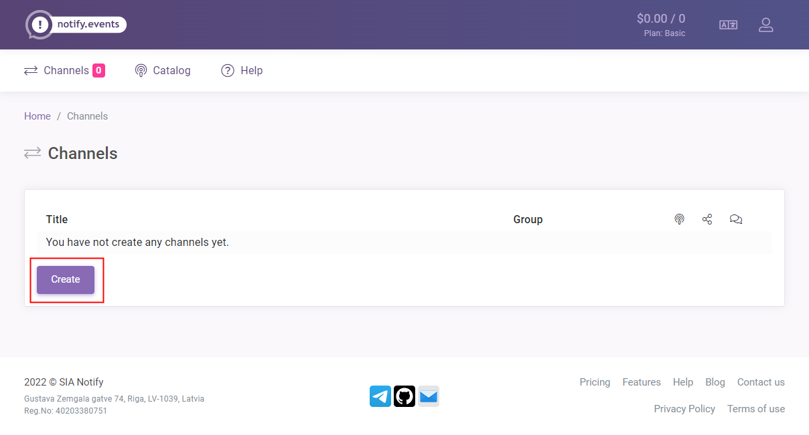

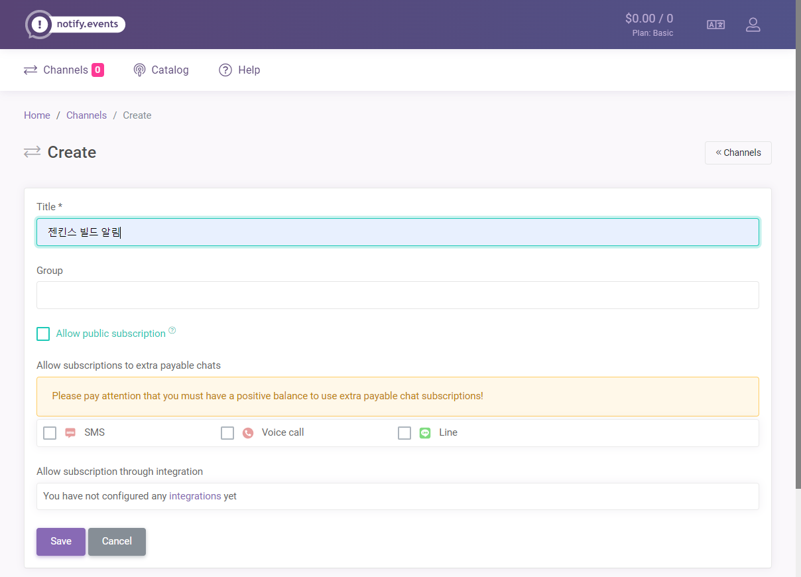

> 여기에서 subscription 이라는것은 `Recipients` 를 추가하는 방법을 의미한다. `Channel` 의 소유자가 아닌 다른 유저들이 `Channel` 의 `Recipients` 에 자신을 등록 할 수 있다.

## 3. Source 추가하기
`Channel `생성을 완료했다면 상세페이지에서 Add Source 버튼을 눌러 `Source` 를 추가한다.  

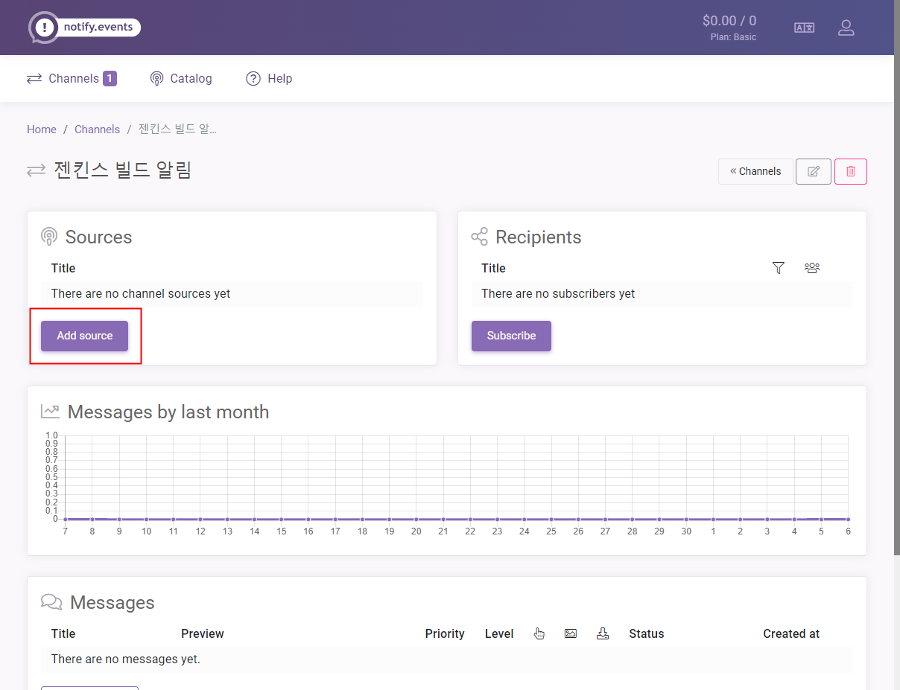

CI/CD and Version control 탭에서 Jenkins 를 클릭하고 기본 설정 그대로 추가한다.

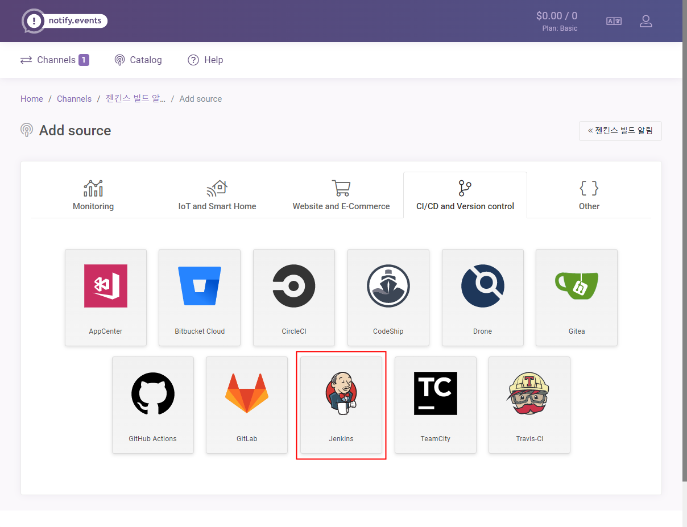
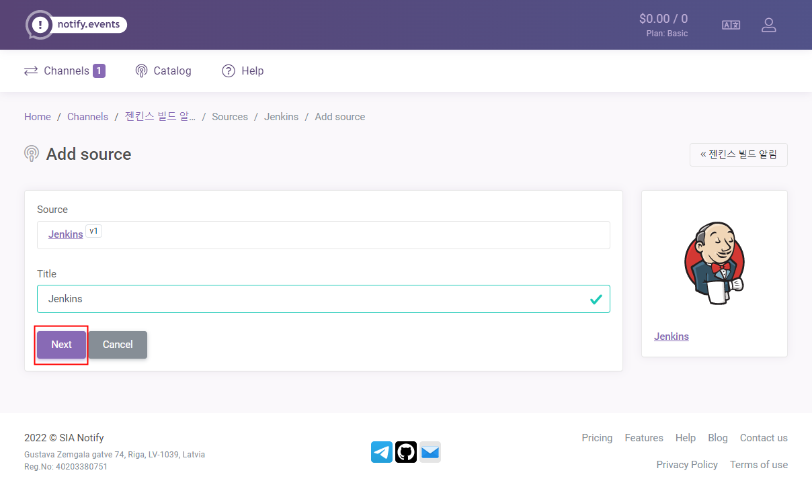

이렇게 `Source` 를 추가하면 토큰 값이 생성된다. 이 토큰은 바로 사용해야 하기 때문에 복사해주자. 

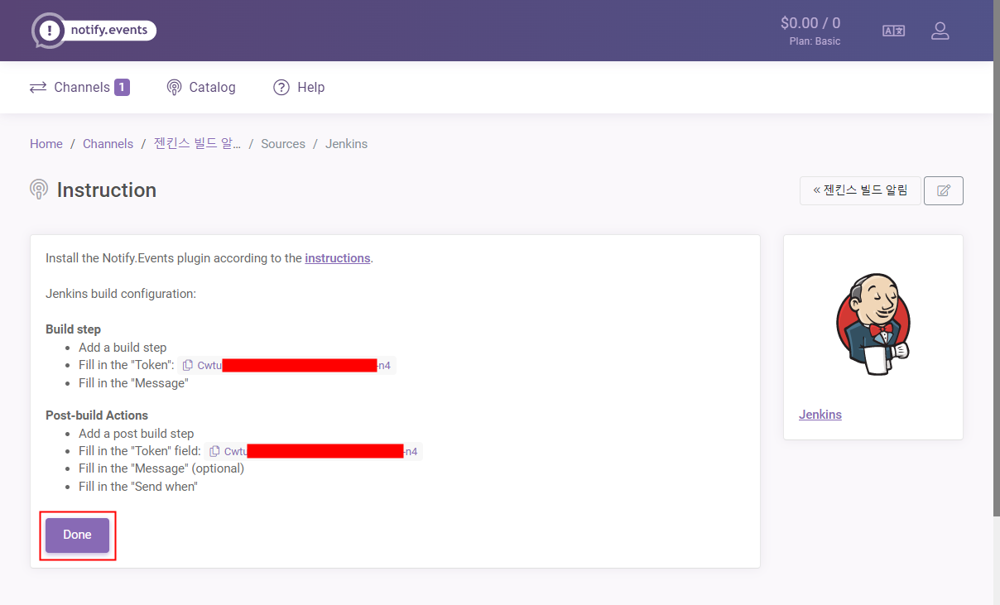

## 4. 젠킨스에서 notify.event 설정하기
이제 젠킨스에서 빌드시 notify.event 로 전달하도록 해야한다.

### 4.1 플러그인 설치하기  

다음 사진처럼 `jenkins 관리` - `플러그인 관리` 로 들어가 플러그인을 추가한다.
> 사진은 플러그인이 이미 설치된 상태인데 설치 가능 탭에서 검색하여 다운로드 한다.

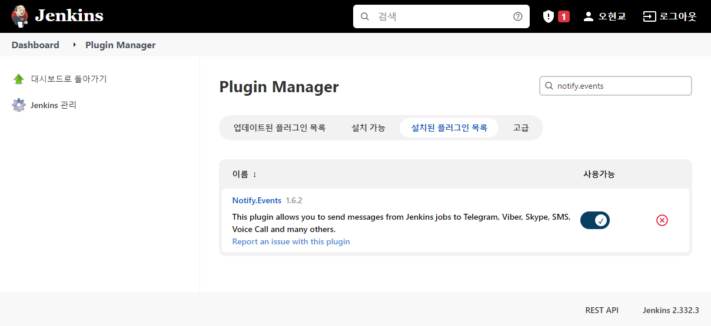

### 4.2 빌드 후 조치(post build) 설정하기
아래와 같이 프로젝트의 빌드 후 조치 탭을 수정한다.  
복사한 토큰만 붙여넣고 나머지 부분은 기본값을 사용해도 충분하다.

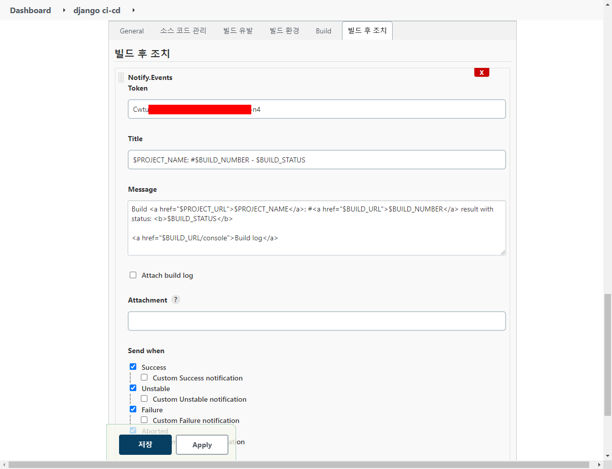

## 5. Recipients 추가하기
이제 실제로 메시지를 수신 할 사용자를 추가한다.  
`Channel` 상세 페이지에서 Subscribe 버튼을 클릭한다.

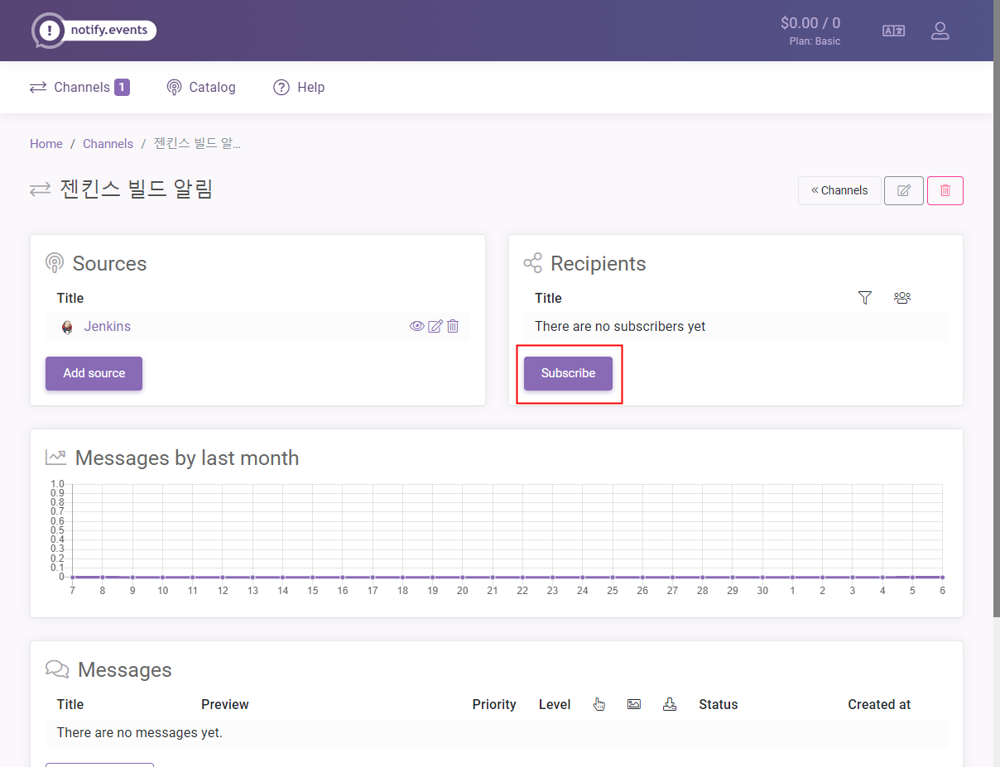

여러 서비스 중에서 텔레그램을 선택한다

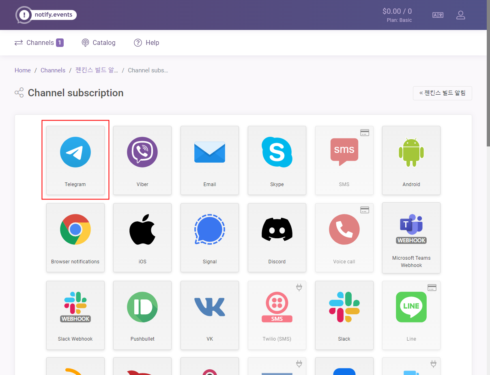

텔레그램을 선택하면 나오는 설명인데, 요약하자면 NotifyEventsBot 을 텔레그램 채팅 리스트에 추가하고 명령어를 입력하라는것이다.  
Notify.Events bot 링크를 클릭하여 텔레그램 봇과 채팅을 시작한 뒤 명령어를 입력하면 된다.

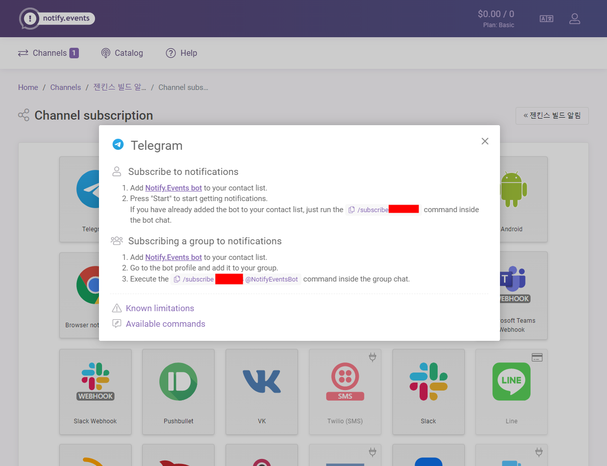

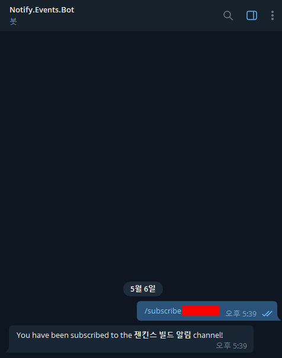

이렇게 하면 해당 `Channel` 을 구독 완료했다는 메시지를 받을 수 있다.

## 6. 채널 상태 확인하기
다음과 같이 채널에서 `Sources` 와 `Recipients` 가 설정되어 있다면 준비가 완료된것이다.

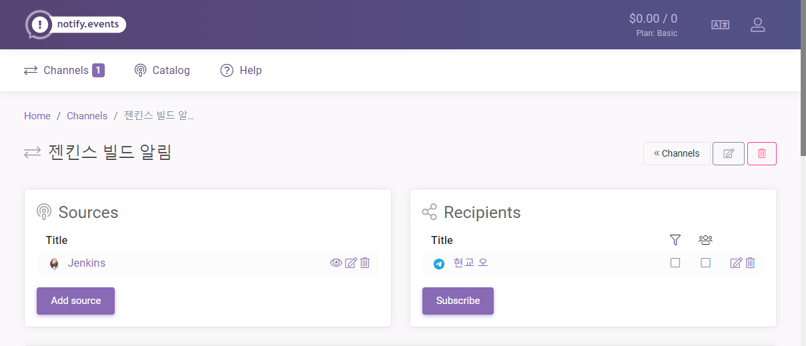

## 7. 빌드해보기
젠킨스로 돌아가서 해당 프로젝트를 빌드하면 다음과 같이 결과에 대한 메시지를 수신 할 수 있다.  

