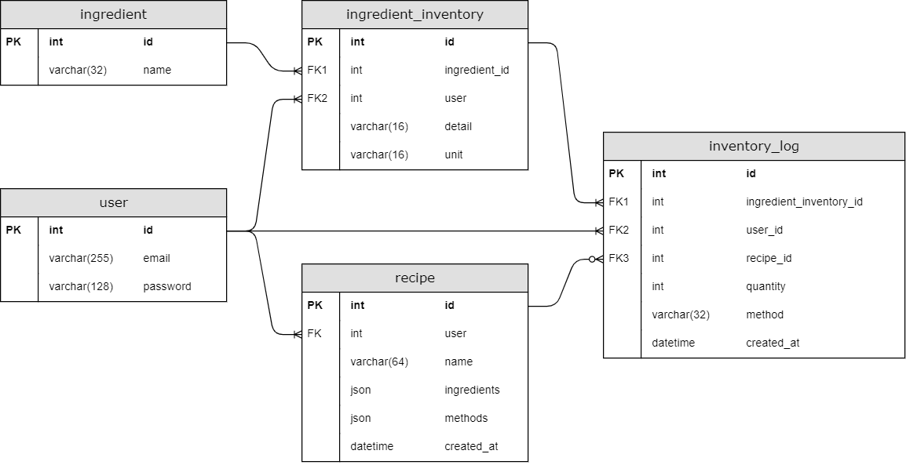
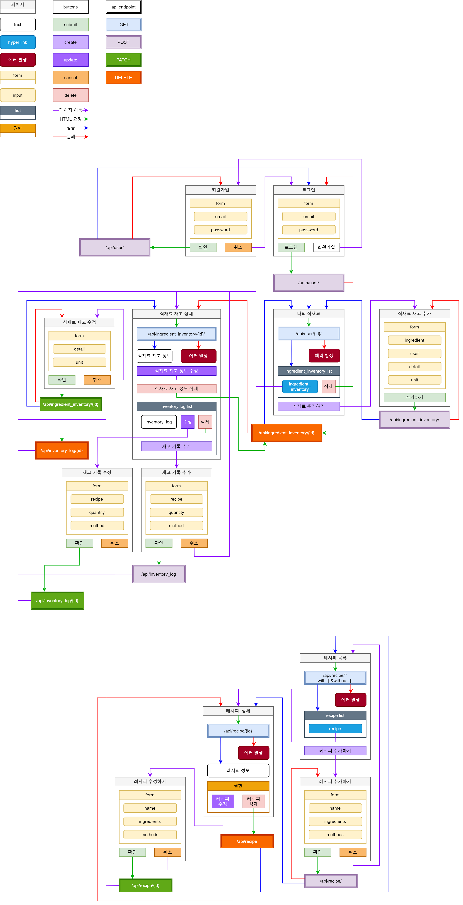

## 0. 서론
프로젝트 시작을 위해 많은 고민을 하던중에 이 고민들과 이후에 결정하는 것들을 모두 기록할 필요가 있다는 생각이 들었다.   
기록할 내용에 대해서는 이미 생각했고 형식만 정하면 됐는데, 마침 어떤 블로그에서 내 상황에 맞는 좋은 서식을 발견하여 사용해보기로 했다.

이후에 개발이 완료되면 이 문서를 토대로 소프트웨어 산출물을 제작할 예정이다.

## 1. 프로젝트 주제 선정
나는 유투부 요리 영상을 즐겨보는 편인데, 그중에서 만만하다 싶은것들은 따라해보기도 한다.  
특별히 어려운 과정 없이 재료를 준비하고 순서대로 넣기만 하면 되는 간단한 요리들을 여러가지 해봤다.  

그런데 초보인 나에게는 요리에 쓰일 식재료를 관리하는것이 쉽지 않았다.   
퇴근길 마트에 들러 부족한 재료들을 구매 하려고 할때 냉장고에 어떤 재료가 얼만큼 남아있는지, 얼마나 더 사야 하는지, 앞으로 몇번이나 사용할 수 있는지 같은것들을 직관적으로 파악하기 힘들었다.     
이런 어려움을 해결하기 위해 냉장고의 식재료를 관리하는 프로그램을 만들고자 하는 생각이 있었는데
이번 프로젝트를 통해 내가 직접 기획, 개발하고 사용해 보기로 했다.   

## 2. 개요
- 프로젝트 이름 : 가온(가제)  
- 개발 (목표) 기간 : 2022-06-17 ~ 2022-07-31
- 목적 : 보유한 식재료 관리 및 그것으로 제작 가능한 결과물 검색
- 주요 기능 :
  - 보유한 식재료 관리
  - 레시피 관리

## 3. 요구사항 분석
다른 프로젝트에서 이미 개발했던 내용을 토대로 신규 프로젝트의 요구사항을 생각해보고 정리했다.

### 3.1 페이지 요구사항(front-end)
\* 이 포함된 페이지는 로그인이 필요한 페이지.

- 회원가입
  - 입력받은 회원 정보에 대한 유효성 검사와 중복 검사를 진행한다.
  - 검사가 완료된 데이터를 서버로 전송한 뒤 전달받은 결과를 출력한다.
- 로그인
  - 입력받은 이메일의 유효성 검사를 진행한다.
  - 이메일과 비밀번호를 서버로 전송한 뒤 전달받은 결과를 출력한다.
- 나의 식재료\*
  - 회원의 상세 정보를 출력한다.
  - 식재료 재고 목록을 출력한다.
- 식재료 추가\*
  - 식재료 이름 중복검사를 진행한다.
  - 식재료 데이터를 서버로 전송한 뒤 전달받은 결과를 출력한다.
- 식재료 재고에 추가\*
  - 추가될 식재료를 식재료 이름으로 검색하여 선택한다.
  - 식재료 이름 검색시 자동 완성 기능을 제공한다.
  - 이미지를 등록할 수 있다.
  - 보유한 식재료 데이터를 서버로 전송한 뒤 전달받은 결과를 출력한다.
- 식재료 재고 상세\*
  - 식재료 재고에 추가한 식재료의 상세 정보와 사용 기록을 출력한다.
- 식재료 재고 수정\*
  - 식재료 재고에 있는 식재료의 상세 정보를 수정한다.
  - 수정한 데이터를 서버로 전송한 뒤 전달받은 결과를 출력한다.
- 재고 기록 추가\*
  - 재고 기록에 필요한 데이터를 서버로 전송한 뒤 전달받은 결과를 출력한다.
- 재고 기록 수정\*
  - 재고 기록 정보를 수정한다.
  - 수정한 데이터를 서버로 전송한 뒤 전달받은 결과를 출력한다.
- 레시피 등록\*
  - 식재료 재고에서 식재료를 선택한다.
  - 레시피에서 사용하는 식재료에 부가적인 설명을 등록할 수 있다.
  - 요리 단계별 설명을 작성한다. 각 단계의 순서를 변경할 수 있다.
- 레시피 목록
  - 최근에 등록된 레시피 일부를 출력한다.
  - 태그 추가하는것처럼 식재료를 추가 하여 해당 식재료를 포함 또는 불포함 하는 레시피를 검색 가능하다.
  - 검색 조건을 서버로 전송한 뒤 전달받은 결과를 출력한다.
- 레시피 상세
  - 사용된 식재료를 보유하고 있는지 표시한다.\*
  - 레시피 상세 데이터를 서버에서 전달받아 출력한다.
- 레시피 수정\*
  - 레시피 정보를 수정한다.
  - 수정한 데이터를 서버로 전송한 뒤 전달받은 결과를 출력한다.

### 3.2 기능 요구사항(Functional Requirements, back-end)
- 레시피에서 사용한 식재료들의 기록을 재고 기록에 일괄 추가한다.
  - 특정 재료를 차감하거나 차감 하지 않는것을 선택 가능.
- 외부 쇼핑몰에서 구매한 내역을 식재료 재고 또는 재고 기록에 추가.

### 3.3 비기능 요구사항(Non-Functional Requirements)
#### 3.3.1 개발 스택
- Application and Data
  - front-end : javascript, svelte, Amazon S3
  - back-end : python, django, nginx, gunicorn, Amazon EC2
  - database : mariadb, Amazon RDS
- dev-ops
  - 버전관리 : Git, GitHub
  - CI/CD : Jenkins
  - 가상화 : docker
#### 3.3.2 소프트웨어 버전
- svelte : latest
- python : 3.8
- django : 3.2.6
- nginx : docker image(nginx:latest)
- gunicorn : latest
- mariadb : latest(Amazon RDS)
- Jenkins : docker image(jenkins/jenkins:lts)
- docker : latest
#### 3.3.3 사용성
- 각 페이지에서 필요한 기능의 API Endpoint 를 제공한다.(back-end)
#### 3.3.4 성능
- 동시접속자 50명을 가정하고 적절한 성능의 인프라 구축.(dev-ops)
#### 3.3.5 배포
- [젠킨스를 사용한 장고 배포](/DevOps/deploy-django-with-jenkins/) 와 동일한 방식으로 배포.(dev-ops)

## 4. DB 설계
### 4.1 모델 명세서
모델 명세서에는 django 의 `models.py` 파일에서 필요한 필드 이름, 옵션등을 서술한다.  

#### 4.1.1 User - 사용자
| no  | Field Name | Field Type | Option                      | 설명      |
|-----|------------|------------|-----------------------------|---------|
| 1   | email      | EmailField | max_length=255, unique=True | 사용자 이메일 | 

#### 4.1.2 Ingredient - 식재료
| no  | Field Name | Field Type | Option                     | 설명    |
|-----|------------|------------|----------------------------|-------|
| 1   | name       | CharField  | max_length=32, unique=True | 식재료 명 | 

#### 4.1.3 IngredientInventory - 식재료 재고
| no  | Field Name | Field Type | Option                               | 설명        |
|-----|------------|------------|--------------------------------------|-----------|
| 1   | ingredient | ForeignKey | to=Ingredient, on_delete=PROTECT     | 식재료       | 
| 2   | user       | ForeignKey | to=User, on_delete=CASCADE           | 사용자       | 
| 3   | detail     | CharField  | max_length=16, null=True, blank=True | 식재료 상세 내용 | 
| 4   | unit       | CharField  | max_length=16                        | 단위        | 

#### 4.1.4 InventoryLog - 재고 기록
| no  | Field Name           | Field Type    | Option                                        | 설명       |
|-----|----------------------|---------------|-----------------------------------------------|----------|
| 1   | ingredient_inventory | ForeignKey    | to=IngredientInventory, on_delete=PROTECT     | 식재료 재고   | 
| 2   | user                 | ForeignKey    | to=User, on_delete=CASCADE                    | 사용자      | 
| 3   | recipe               | ForeignKey    | to=Recipe, on_delete=?, null=True, blank=True | 레시피      | 
| 4   | quantity             | IntegerField  |                                               | 수량       | 
| 5   | method               | CharField     | max_length=16                                 | 재료 처리 방법 | 
| 6   | created_at           | DateTimeField | auto_now_add=True                             | 기록 생성 일시 | 

#### 4.1.5 Recipe - 레시피
| no  | Field Name  | Field Type    | Option               | 설명          |
|-----|-------------|---------------|----------------------|-------------|
| 1   | user        | CharField     | to=user, on_delete=? | 사용자         | 
| 2   | name        | CharField     | max_length=64        | 레시피 이름      |
| 3   | ingredients | JsonField     |                      | 레시피에 사용된 재료 | 
| 4   | methods     | JsonField     |                      | 레시피 제작 방법   | 
| 5   | created_at  | DateTimeField | auto_now_add=True    | 레시피 등록 일시   |

현재 기획한것과 최종형태의 DB가 얼마나 어떻게 달라지는지 기록할 필요가 있다는 생각이 들었기 때문에 명세서 양식을 엑셀파일에서 마크다운 형식으로 변경했다.

엑셀 형식의 명세서는 개발 완료 후 산출물에 포함할 예정이다.

### 4.2 ERD
`models.py` 파일을 참조해 생성될 데이터베이스 테이블의 ERD 이다. 

## 5. API 명세서
각 API Endpoint 의 상세 정보를 담은 문서로, 내용이 많기 때문에 별도의 페이지를 통해 관리한다.

[API 명세서](/project-gaon/api-specification/)

## 6. 화면설계서
나는 화면설계서를 통해 각 페이지 간 흐름, API 요청과 그 결과에 따른 페이지 이동을 한눈에 보고 싶었다.  
실제 화면에 필요한 내용은 최대한 간략히 포함하고 전체적 흐름을 위주로 보고자 했던 것이였다.

화면설계서 중 와이어프레임은 인터페이스를 시각적으로 간단히 묘사한것이고, 프로토타입은 상호작용을 시뮬레이션 하는것이라고 한다.  
두가지 모두 UI/UX 와 연결된 '디자인' 산출물 이라고 하는데 나는 UI/UX 에 대해 잘 모르기도 하고 보여지는 웹 화면은 현재 나에겐 주요 개발 대상이 아니기 때문에 다음 사진처럼 draw.io 를 통해 내가 필요한 정보를 담도록 제작했다.

이 사진을 통해 전체 페이지 이동에 대한 정보와 각 페이지의 버튼이 어느 API Endpoint 로 요청을 보내는지, 어느 페이지로 이동하는지 쉽게 파악할 수 있다.(고 생각중)

## 7. 개발일지

[개발일지](/project-gaon/dev-log/)

## References
[가온](https://www.ihee.com/636)  
[0. 어떤 블로그](https://dev-coco.tistory.com/111)  
[3.2 비기능 요구사항](https://ee-22-joo.tistory.com/2)  
[6. 화면설계서 - 와이어프레임과 프로토타입](https://blog.adobe.com/ko/publish/2018/03/06/everything-you-need-to-know-about-wireframes-and-prototypes)  
[6. 프로토타입 예제](https://ditoday.com/%EC%99%80%EC%9D%B4%EC%96%B4%ED%94%84%EB%A0%88%EC%9E%84%EA%B3%BC-%ED%94%84%EB%A1%9C%ED%86%A0%ED%83%80%EC%9E%85-%EA%B5%AC%EB%B3%84%ED%95%98%EA%B8%B0/)
