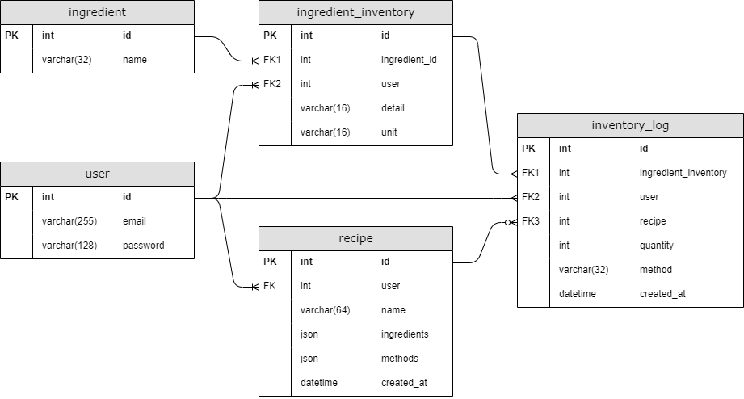

## 0. 서론
포트폴리오를 만들기 위해 고민하던중 이 고민들과 이후 결정한것들을 모두 기록할 필요가 있다고 생각했다.    
무엇을 만들지는 이미 정했기 때문에 기록할 방식만 정하면 됐는데, 마침 어떤 블로그에서 좋은 서식을 발견하여 사용해보기로 했다.

그리고 개발이 끝나면 이 문서를 토대로 소프트웨어 산출물을 제작할 예정이다.

## 1. 프로젝트 목표 선정
예전에 생각했던 냉장고 재고 관리를 처음 생각보다는 조금 축소하여 개발하기로 정했다.

## 2. 개요
- 프로젝트 이름 : 가온(가제)  
- 개발 (목표) 기간 : 2022-06-17 ~ 2022-07-31
- 목적 : 보유한 재료 관리 및 그것으로 제작 가능한 결과물 검색
- 주요 기능 :
  - 보유한 재료 관리
  - 레시피 관리
- 개발 스택 : +
  - Application and Data
    - front-end : javascript, svelte, Amazon S3
    - back-end : python, django, nginx, gunicorn, Amazon EC2
    - database : mariadb, Amazon RDS
  - dev-ops
    - 버전관리 : Git, GitHub
    - CI/CD : Jenkins
    - 가상화 : docker

## 3. 요구사항 분석
### 3.1 페이지 요구사항
\* 이 포함된 페이지는 로그인이 필요한 페이지 또는 기능입니다.

- 회원가입
  - 입력받은 회원 정보에 대한 유효성 검사와 중복 검사를 진행한다.
  - 검사가 완료된 데이터를 서버로 전송한 뒤 전달받은 결과를 출력한다.
- 로그인
  - 입력받은 이메일의 유효성 검사를 진행한다.
  - 이메일과 비밀번호를 서버로 전송한 뒤 전달받은 결과를 출력한다.
- 회원 상세 페이지\*
  - 회원의 상세 정보를 출력한다.
  - 식재료 재고 목록을 출력한다.
- 식재료 추가\*
  - 식재료 이름 중복검사를 진행한다.
  - 식재료 데이터를 서버로 전송한 뒤 전달받은 결과를 출력한다.
- 식재료 재고에 추가\*
  - 추가될 식재료를 식재료 이름으로 검색하여 선택한다.
  - 식재료 이름 검색시 자동 완성 기능을 제공한다.
  - 이미지를 등록할 수 있다.
  - 보유한 식재료 데이터를 서버로 전송한 뒤 전달받은 결과를 출력한다.
- 식재료 재고 상세\*
  - 식재료 재고에 추가한 식재료의 상세 정보와 사용 기록을 출력한다.
- 식재료 재고 수정\*
  - 식재료 재고에 있는 식재료의 상세 정보를 수정한다.
  - 수정한 데이터를 서버로 전송한 뒤 전달받은 결과를 출력한다.
- 재고 기록 추가\*
  - 재고 기록에 필요한 데이터를 서버로 전송한 뒤 전달받은 결과를 출력한다.
- 재고 기록 수정\*
  - 재고 기록 정보를 수정한다.
  - 수정한 데이터를 서버로 전송한 뒤 전달받은 결과를 출력한다.
- 레시피 등록\*
  - 식재료 재고에서 식재료를 선택한다.
  - 레시피에서 사용하는 식재료에 부가적인 설명을 등록할 수 있다.
  - 요리 단계별 설명을 작성한다. 각 단계의 순서를 변경할 수 있다.
- 레시피 목록
  - 최근에 등록된 레시피 일부를 출력한다.
  - 태그 추가하는것처럼 식재료를 추가 하여 해당 식재료를 포함 또는 불포함 하는 레시피를 검색 가능하다.
  - 검색 조건을 서버로 전송한 뒤 전달받은 결과를 출력한다.
- 레시피 상세
  - 사용된 식재료를 보유하고 있는지 표시한다.\*
  - 레시피 상세 데이터를 서버에서 전달받아 출력한다.
- 레시피 수정\*
  - 레시피 정보를 수정한다.
  - 수정한 데이터를 서버로 전송한 뒤 전달받은 결과를 출력한다.

### 3.2 기능 요구사항(Functional Requirements)
- 레시피에서 사용한 식재료들의 기록을 재고 기록에 일괄 추가한다.
- 쇼핑몰에서 구매한 내역으로 식재료 추가.

### 3.3 비기능 요구사항(Non-Functional Requirements)
- 성능
- 사용자 예측

## 4. DB 설계
> 이 문서를 완성하기까지, 그리고 개발을 완료하기까지 DB 설계가 여러번 변경되겠지만 현재 기획한것과 최종형태의 DB가 얼마나 어떻게 달라지는지 기록하는것도 필요하겠다는 생각이 들었다.
### 4.1 모델 명세서
#### 4.1.1 User - 사용자
| no  | Field Name | Field Type | Option                      | 설명      |
|-----|------------|------------|-----------------------------|---------|
| 1   | email      | EmailField | max_length=255, unique=True | 사용자 이메일 | 

#### 4.1.2 Ingredient - 식재료
| no  | Field Name | Field Type | Option                     | 설명    |
|-----|------------|------------|----------------------------|-------|
| 1   | name       | CharField  | max_length=32, unique=True | 식재료 명 | 

#### 4.1.3 IngredientInventory - 식재료 재고
| no  | Field Name | Field Type | Option                               | 설명        |
|-----|------------|------------|--------------------------------------|-----------|
| 1   | ingredient | ForeignKey | to=Ingredient, on_delete=PROTECT     | 식재료       | 
| 2   | user       | ForeignKey | to=User, on_delete=CASCADE           | 사용자       | 
| 3   | detail     | CharField  | max_length=16, null=True, blank=True | 식재료 상세 내용 | 
| 4   | unit       | CharField  | max_length=16                        | 단위        | 

#### 4.1.4 InventoryLog - 재고 기록
| no  | Field Name           | Field Type    | Option                                        | 설명       |
|-----|----------------------|---------------|-----------------------------------------------|----------|
| 1   | ingredient_inventory | ForeignKey    | to=IngredientInventory, on_delete=PROTECT     | 식재료 재고   | 
| 2   | user                 | ForeignKey    | to=User, on_delete=CASCADE                    | 사용자      | 
| 3   | recipe               | ForeignKey    | to=Recipe, on_delete=?, null=True, blank=True | 레시피      | 
| 4   | quantity             | IntegerField  | max_length=16                                 | 수량       | 
| 5   | method               | CharField     | max_length=16                                 | 재료 처리 방법 | 
| 6   | created_at           | DateTimeField | auto_now_add=True                             | 기록 생성 일시 | 

#### 4.1.5 Recipe - 레시피
| no  | Field Name  | Field Type    | Option               | 설명          |
|-----|-------------|---------------|----------------------|-------------|
| 1   | user        | CharField     | to=user, on_delete=? | 사용자         | 
| 2   | name        | CharField     | max_length=64        | 레시피 이름      |
| 3   | ingredients | JsonField     |                      | 레시피에 사용된 재료 | 
| 4   | methods     | JsonField     |                      | 레시피 제작 방법   | 
| 5   | created_at  | DateTimeField | auto_now_add=True    | 레시피 등록 일시   |

### 4.2 ERD

## 5. API 명세서
[API 명세서](/project-gaon/api-specification/)

## 6. 프로토타입

## References
[가온](https://www.ihee.com/636)  
[0. 어떤 블로그](https://dev-coco.tistory.com/111)  
[6. 프로토타입](https://ditoday.com/%EC%99%80%EC%9D%B4%EC%96%B4%ED%94%84%EB%A0%88%EC%9E%84%EA%B3%BC-%ED%94%84%EB%A1%9C%ED%86%A0%ED%83%80%EC%9E%85-%EA%B5%AC%EB%B3%84%ED%95%98%EA%B8%B0/)
